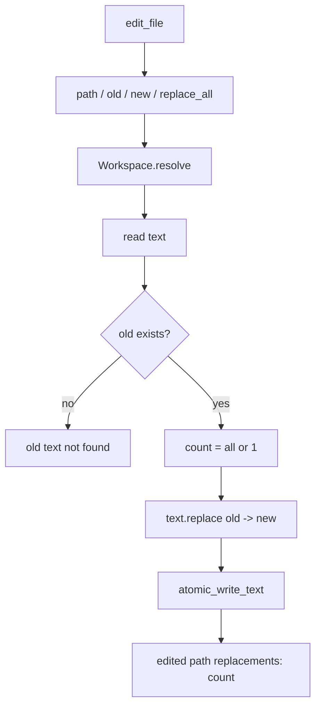

# 051-工具层-Filesystem-Replace All Matches

## 中文版：编辑工具要能明确替换一个还是全部

### 全局作用

参见：[000-总览-Harness-分层架构与连载目录](000-总览-Harness-分层架构与连载目录.md)。本文位于工具层的 Filesystem Edit 分支。

Replace All Matches 为 `edit_file` 增加 `replace_all` 参数，让模型可以明确选择只替换第一次匹配，还是替换文件中所有匹配。它避免模型为了全局替换反复调用工具，也降低手写 shell 的需求。

### 输入 / 输出 / 行为

- 输入：path、old、new、replace_all。
- 输出：编辑结果和替换次数。
- 行为：
  - `replace_all=false` 时只替换第一个匹配。
  - `replace_all=true` 时替换全部匹配。
  - 找不到 old 时返回错误。
  - 写入仍通过 atomic write。
- 失败模式：路径逃逸、权限不足、old 不存在、参数类型错误都会失败。

### 实现原理与流程图

替换计数由 `text.count(old)` 和 `str.replace(old,new,count)` 控制。工具先模拟 count，再写入更新后的文本。



### 当前实现

| 项 | 状态 |
|---|---|
| 层 | 工具层 |
| 模块 | Filesystem |
| 子模块 | Replace All Matches |
| 实现状态 | 已实现 |
| 对应提交 | `9bdb237 Support replacing all file matches` |

- 工具：`edit_file`
- 参数：`replace_all`
- 权限：`workspace-write`

### 横向对标

| Harness | 对应实现 | 实现原理 |
|---|---|---|
| Claude Code | file edit、permission hooks | 编辑工具需要精确表达修改范围，避免模型用 shell 做危险替换。 |
| Codex | file tools、approval cache | 替换范围会影响审批和 diff 展示。 |
| OpenClaw | filesystem bridge、exec approval | 跨节点编辑要求补丁语义清晰。 |
| Hermes Agent | checkpoint、approval、trajectory | 全局替换应能进入轨迹和回滚链路。 |

本仓库把全局替换作为显式参数，而不是另建工具，保持 edit/diff 语义统一。

### 测试例跑法

```bash
PYTHONPATH=src python3 -m pytest tests/test_tools_workspace.py::test_edit_file_can_replace_all_matches_when_requested -q
```

读者验证点：开启 `replace_all` 后文件中所有匹配文本都会被替换，并返回正确替换次数。

### 后续扩展

- 支持正则替换。
- 支持替换前 diff 必须通过审批。
- 将替换次数写入 trace。

## English Version

Replace-all editing makes the replacement scope explicit, keeping broad file
changes inside the safer file tool path instead of shell commands.
