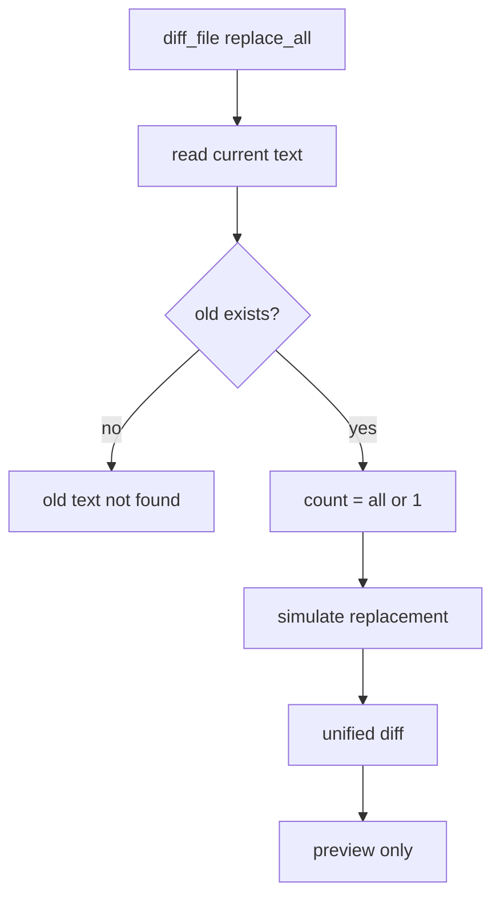

# 052-工具层-Filesystem-Diff Preview Replace All

## 中文版：预览和真实编辑必须同一套语义

### 全局作用

参见：[000-总览-Harness-分层架构与连载目录](000-总览-Harness-分层架构与连载目录.md)。本文位于工具层的 Filesystem Diff/Edit 分支。

Diff Preview Replace All 让 `diff_file` 也支持 `replace_all`。这样模型先预览全局替换，再执行 `edit_file replace_all=true` 时，两者的替换范围一致。

### 输入 / 输出 / 行为

- 输入：path、old、new、replace_all。
- 输出：unified diff。
- 行为：
  - `replace_all=false` 只预览第一次替换。
  - `replace_all=true` 预览全部替换。
  - 不修改原文件。
  - old 不存在时报错。
- 失败模式：路径错误、参数错误、old 不存在、编码错误都会失败。

### 实现原理与流程图

`diff_file` 使用和 `edit_file` 相同的 count 计算，只是把结果交给 `difflib.unified_diff`，不写回文件。



### 当前实现

| 项 | 状态 |
|---|---|
| 层 | 工具层 |
| 模块 | Filesystem |
| 子模块 | Diff Preview Replace All |
| 实现状态 | 已实现 |
| 对应提交 | `e7ff86c Align diff preview with replace all edits` |

- 工具：`diff_file`
- 参数：`replace_all`
- 对齐对象：`edit_file`

### 横向对标

| Harness | 对应实现 | 实现原理 |
|---|---|---|
| Claude Code | file edit preview、permission hooks | 预览语义必须与实际编辑一致，才能支撑用户确认。 |
| Codex | diff/approval、rollout trace | approval 看到的 diff 应等于实际应用的变更。 |
| OpenClaw | exec approval、filesystem bridge | 远端编辑更依赖准确 diff。 |
| Hermes Agent | approval、checkpoint、trajectory | diff 进入轨迹后要能映射实际修改。 |

本仓库用同一套替换参数保持预览和落盘一致，是后续审批流的基础。

### 测试例跑法

```bash
PYTHONPATH=src python3 -m pytest tests/test_tools_workspace.py::test_diff_file_can_preview_all_replacements_when_requested tests/test_tools_workspace.py::test_diff_file_previews_replacement_without_modifying_file -q
```

读者验证点：全局替换预览能展示所有修改，但原文件保持不变。

### 后续扩展

- 将 diff preview 与 edit approval 串联。
- 支持 patch id，确保应用的是已预览版本。
- 支持多文件 diff。

## English Version

Diff preview replace-all keeps preview semantics aligned with edit semantics,
which is necessary for reliable approval flows.
