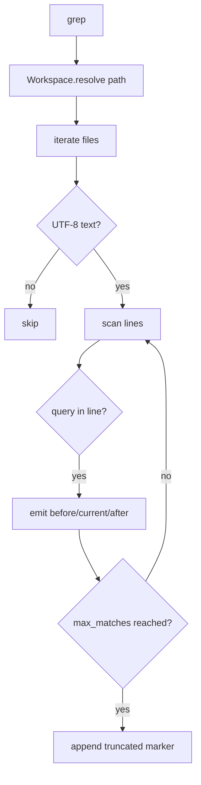

# 053-工具层-Search-Grep Context And Limits

## 中文版：搜索结果要有上下文，也要有限制

### 全局作用

参见：[000-总览-Harness-分层架构与连载目录](000-总览-Harness-分层架构与连载目录.md)。本文位于工具层的 Search 分支。

Grep Context And Limits 为 `grep` 增加 `context_lines` 和 `max_matches`。搜索只返回匹配行常常不够，返回太多又会污染上下文；这两个参数让搜索结果在可读性和 token 控制之间取得平衡。

### 输入 / 输出 / 行为

- 输入：query、path、context_lines、max_matches。
- 输出：匹配行及可选上下文行。
- 行为：
  - `context_lines` 控制匹配前后行。
  - `max_matches` 控制匹配数量。
  - 达到上限时追加 truncated 提示。
  - 跳过二进制或不可解码文件。
- 失败模式：负数 context/max 会返回错误；路径逃逸由 Workspace 拦截。

### 实现原理与流程图

grep 逐文件读取文本行，命中后按行号范围输出上下文。匹配数量达到上限时提前停止。



### 当前实现

| 项 | 状态 |
|---|---|
| 层 | 工具层 |
| 模块 | Search |
| 子模块 | Grep Context And Limits |
| 实现状态 | 已实现 |
| 对应提交 | `78b3e59 Add grep context and match limits` |

- 工具：`grep`
- 参数：`context_lines`、`max_matches`

### 横向对标

| Harness | 对应实现 | 实现原理 |
|---|---|---|
| Claude Code | file search、LSP/code intelligence | 搜索结果通常与代码符号和上下文片段结合。 |
| Codex | file search、ToolRouter | 搜索需要限制输出，避免破坏上下文预算。 |
| OpenClaw | context engine、filesystem bridge | 搜索可能跨远端文件系统，限制输出更重要。 |
| Hermes Agent | FTS5 session search、business connectors | 检索层倾向返回可解释片段而不是整库内容。 |

本仓库先实现 literal grep，保留上下文和数量限制，后续可接入 ripgrep/LSP。

### 测试例跑法

```bash
PYTHONPATH=src python3 -m pytest tests/test_tools_workspace.py::test_grep_can_include_context_lines -q
```

读者验证点：搜索结果包含匹配行前后的上下文，并在达到 max 后截断。

### 后续扩展

- 支持正则和 ignore 文件。
- 支持直接输出可传给 read_file 的范围。
- 接入代码符号索引。

## English Version

Grep context and limits make search results useful without flooding the model
context.
