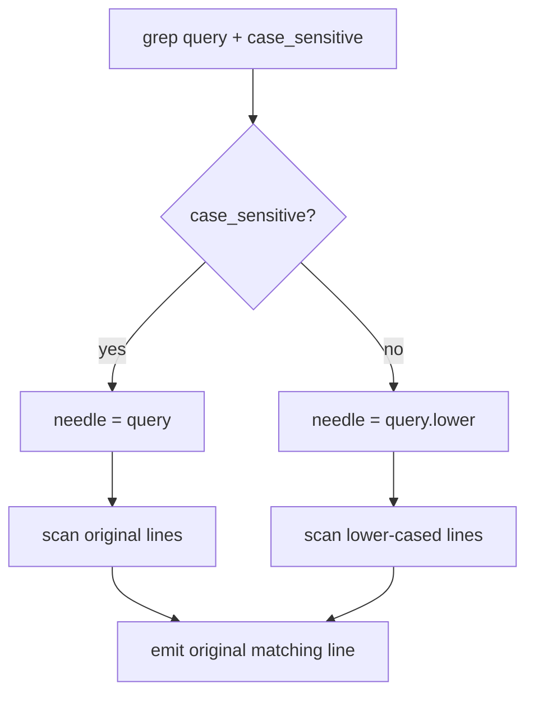

# 054-工具层-Search-Grep Case Insensitive

## 中文版：搜索要能忽略大小写

### 全局作用

参见：[000-总览-Harness-分层架构与连载目录](000-总览-Harness-分层架构与连载目录.md)。本文位于工具层的 Search 分支。

Grep Case Insensitive 为 `grep` 增加 `case_sensitive` 参数。很多代码、文档和日志搜索并不确定大小写，忽略大小写能减少反复搜索。

### 输入 / 输出 / 行为

- 输入：query、case_sensitive。
- 输出：匹配结果。
- 行为：
  - 默认 `case_sensitive=true`。
  - false 时 query 和行内容都转成 lower 比较。
  - 输出仍保留原始行文本。
- 失败模式：case_sensitive 非 boolean 会被参数校验拒绝。

### 实现原理与流程图

搜索时只改变比较用的 haystack/needle，不改变输出文本。



### 当前实现

| 项 | 状态 |
|---|---|
| 层 | 工具层 |
| 模块 | Search |
| 子模块 | Grep Case Insensitive |
| 实现状态 | 已实现 |
| 对应提交 | `0a040a5 Add grep case insensitive option` |

- 工具：`grep`
- 参数：`case_sensitive`

### 横向对标

| Harness | 对应实现 | 实现原理 |
|---|---|---|
| Claude Code | file search、web search | 搜索工具需要支持宽松匹配以减少查询轮次。 |
| Codex | file search、connectors | 搜索参数会影响 ToolRouter 返回的上下文质量。 |
| OpenClaw | context engine、channel connectors | 跨资源搜索需要可配置匹配策略。 |
| Hermes Agent | FTS5 session search、memory providers | 数据库检索通常天然支持大小写或 tokenizer 策略。 |

本仓库保持 literal search，只把大小写作为显式参数，方便模型控制搜索范围。

### 测试例跑法

```bash
PYTHONPATH=src python3 -m pytest tests/test_tools_workspace.py::test_grep_can_filter_by_file_name_pattern -q
PYTHONPATH=src python3 -m pytest tests/test_tools_workspace.py -k case_sensitive -q
```

读者验证点：`case_sensitive=false` 时可以匹配大小写不同的文本，输出保留原始内容。

### 后续扩展

- 支持 fuzzy search。
- 支持 regex flags。
- 接入索引型搜索后保留同名参数。

## English Version

Case-insensitive grep reduces repeated search attempts while preserving the
original matched line in output.
