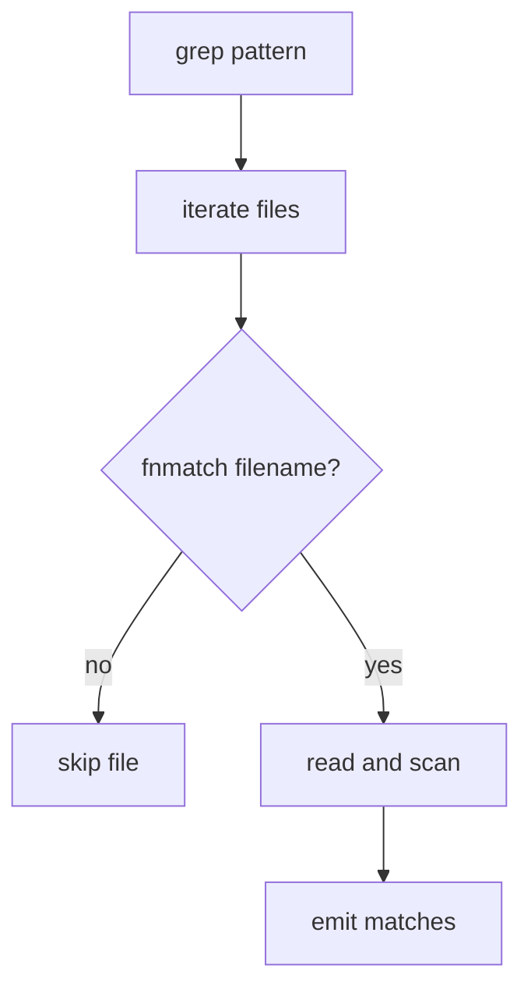

# 055-工具层-Search-Grep File Pattern Filter

## 中文版：搜索要能限定文件名范围

### 全局作用

参见：[000-总览-Harness-分层架构与连载目录](000-总览-Harness-分层架构与连载目录.md)。本文位于工具层的 Search 分支。

Grep File Pattern Filter 为 `grep` 增加 `pattern` 参数，例如 `*.py`、`*.md`。它让 Agent 能在指定文件类型内搜索，减少无关结果和 token 消耗。

### 输入 / 输出 / 行为

- 输入：query、path、pattern。
- 输出：符合文件名 pattern 的匹配结果。
- 行为：
  - pattern 默认 `*`。
  - 使用 `fnmatch` 匹配文件名。
  - 目录递归搜索时跳过不匹配文件。
- 失败模式：路径不存在或逃逸会失败；pattern 语法按 shell glob 处理。

### 实现原理与流程图

文件名过滤发生在读取文件之前，因此能减少 I/O 和上下文输出。



### 当前实现

| 项 | 状态 |
|---|---|
| 层 | 工具层 |
| 模块 | Search |
| 子模块 | Grep File Pattern Filter |
| 实现状态 | 已实现 |
| 对应提交 | `49e364c Add grep file pattern filter` |

- 工具：`grep`
- 参数：`pattern`

### 横向对标

| Harness | 对应实现 | 实现原理 |
|---|---|---|
| Claude Code | file search、LSP/code intelligence | 文件类型过滤和符号索引常配合使用。 |
| Codex | file search、connectors | connector/file search 需要范围约束，减少噪声。 |
| OpenClaw | filesystem bridge、business tools | 跨资源搜索需要先过滤资源类型。 |
| Hermes Agent | FTS5 search、business connectors | 检索通常按 source/type 过滤。 |

本仓库使用简单 glob，是为了保持本地工具可读、可测，后续可迁移到 ripgrep 参数。

### 测试例跑法

```bash
PYTHONPATH=src python3 -m pytest tests/test_tools_workspace.py::test_grep_can_filter_by_file_name_pattern -q
```

读者验证点：同样 query 只在匹配 pattern 的文件中返回结果。

### 后续扩展

- 支持多 pattern。
- 支持 exclude pattern。
- 支持 respect `.gitignore`。

## English Version

Grep file pattern filtering narrows search to relevant file names before
reading file contents.
