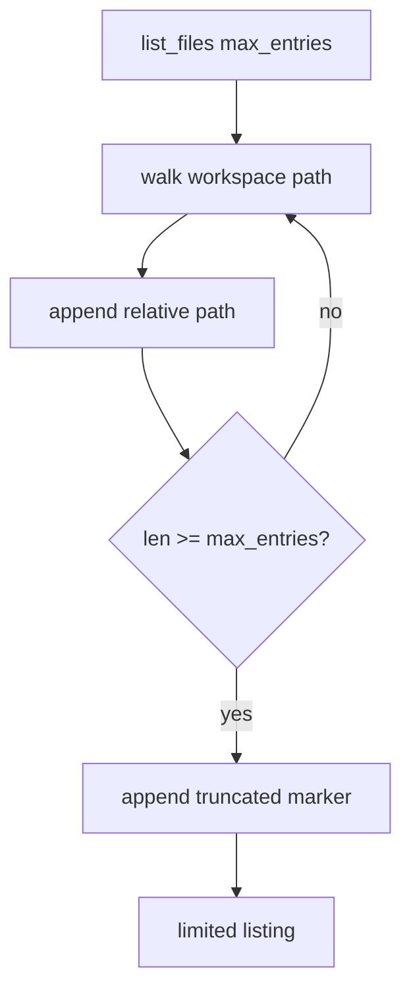

# 056-工具层-Filesystem-List Files Entry Limits

## 中文版：列目录也要防止输出爆炸

### 全局作用

参见：[000-总览-Harness-分层架构与连载目录](000-总览-Harness-分层架构与连载目录.md)。本文位于工具层的 Filesystem List 分支。

List Files Entry Limits 为 `list_files` 增加 `max_entries`，防止大仓库目录列表一次性塞满上下文。目录探索应该可控、可截断、可继续。

### 输入 / 输出 / 行为

- 输入：path、pattern、max_entries。
- 输出：文件/目录相对路径列表。
- 行为：
  - max_entries=0 表示不限制。
  - 达到上限后停止并追加 truncated 提示。
  - 负数 max_entries 返回错误。
- 失败模式：路径不存在、路径逃逸、max_entries 负数会失败。

### 实现原理与流程图

list_files 在遍历时计数，达到上限即停止，不再继续扫描。



### 当前实现

| 项 | 状态 |
|---|---|
| 层 | 工具层 |
| 模块 | Filesystem |
| 子模块 | List Files Entry Limits |
| 实现状态 | 已实现 |
| 对应提交 | `226faca Add list files entry limits` |

- 工具：`list_files`
- 参数：`max_entries`

### 横向对标

| Harness | 对应实现 | 实现原理 |
|---|---|---|
| Claude Code | file search、context compact | 文件列表输出需要配合上下文预算。 |
| Codex | file search、history manager | 目录探索是 ToolRouter 的高频低风险工具，需要输出限制。 |
| OpenClaw | filesystem bridge、context engine | 远端目录列举更需要分页和截断。 |
| Hermes Agent | state/search providers | 检索/列表能力通常带 limit。 |

本仓库使用 max_entries 建立最小输出控制，后续可以改为分页 cursor。

### 测试例跑法

```bash
PYTHONPATH=src python3 -m pytest tests/test_tools_workspace.py::test_list_files_includes_directories_and_can_limit_entries tests/test_tools_workspace.py::test_list_files_rejects_negative_max_entries -q
```

读者验证点：超过上限时输出 truncated；负数参数被拒绝。

### 后续扩展

- 支持分页 cursor。
- 支持目录优先排序。
- 支持 ignore 规则。

## English Version

List file entry limits prevent directory exploration from flooding model
context in large workspaces.
