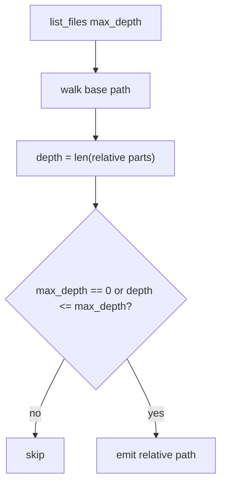

# 057-工具层-Filesystem-List Files Depth Limit

## 中文版：目录探索要能限制递归深度

### 全局作用

参见：[000-总览-Harness-分层架构与连载目录](000-总览-Harness-分层架构与连载目录.md)。本文位于工具层的 Filesystem List 分支。

List Files Depth Limit 为 `list_files` 增加 `max_depth`，让 Agent 能先看浅层结构，再按需深入。它避免一开始就把深层依赖目录或构建产物全部展开。

### 输入 / 输出 / 行为

- 输入：path、pattern、max_depth。
- 输出：不超过深度的相对路径列表。
- 行为：
  - max_depth=0 表示不限制。
  - depth 按相对 path parts 计算。
  - 超出深度的路径跳过。
  - 负数 max_depth 返回错误。
- 失败模式：路径不存在、路径逃逸、max_depth 负数会失败。

### 实现原理与流程图

遍历每个 path 时计算它相对于 base 的 parts 数，超过 max_depth 即跳过。



### 当前实现

| 项 | 状态 |
|---|---|
| 层 | 工具层 |
| 模块 | Filesystem |
| 子模块 | List Files Depth Limit |
| 实现状态 | 已实现 |
| 对应提交 | `8e56221 Add list files depth limit` |

- 工具：`list_files`
- 参数：`max_depth`

### 横向对标

| Harness | 对应实现 | 实现原理 |
|---|---|---|
| Claude Code | file search、project context | 分层看目录结构有助于建立项目地图。 |
| Codex | file search、ToolRouter | depth limit 是本地探索工具常见安全阀。 |
| OpenClaw | filesystem bridge | 远端目录需要控制递归深度和传输量。 |
| Hermes Agent | business connectors、file providers | 数据源列表通常支持 scope/depth。 |

本仓库把 depth limit 作为显式参数，方便模型先浅后深地探索 workspace。

### 测试例跑法

```bash
PYTHONPATH=src python3 -m pytest tests/test_tools_workspace.py::test_list_files_can_limit_recursion_depth tests/test_tools_workspace.py::test_list_files_rejects_negative_max_depth -q
```

读者验证点：max_depth=1 不返回二级子目录内容；负数参数被拒绝。

### 后续扩展

- 支持只列目录。
- 支持按文件类型计数摘要。
- 支持分页和 ignore。

## English Version

List file depth limits let agents explore workspace structure progressively
without expanding every nested directory.
