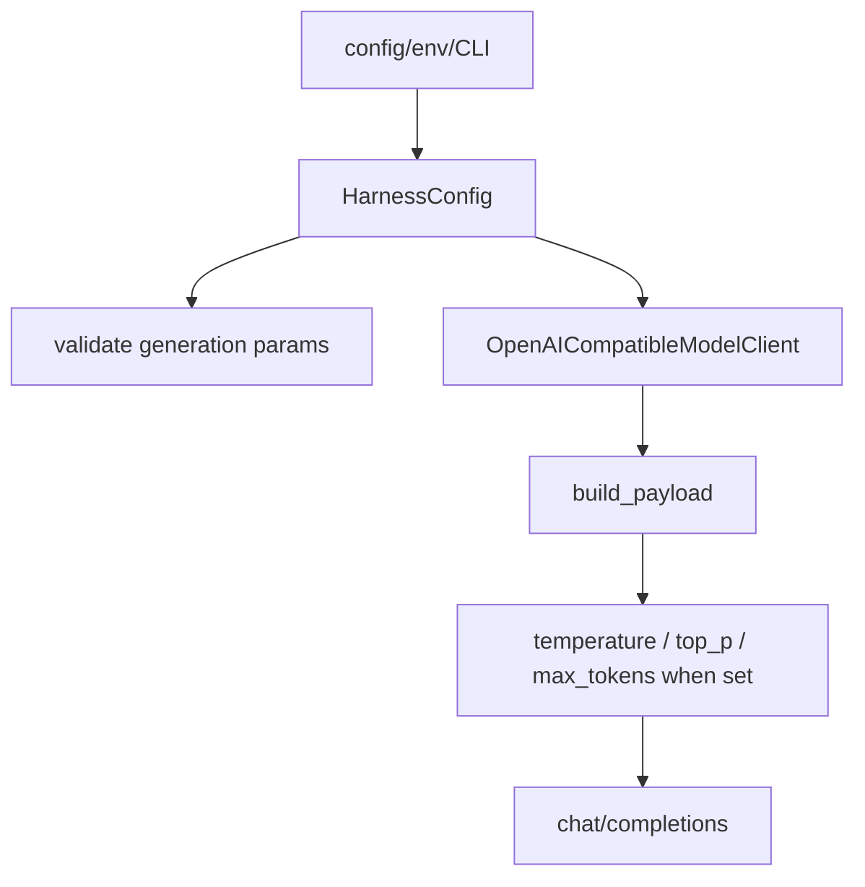

# 058-模型层-Model-Generation Parameters

## 中文版：模型请求需要可控的生成参数

### 全局作用

参见：[000-总览-Harness-分层架构与连载目录](000-总览-Harness-分层架构与连载目录.md)。本文位于模型接入层。

Model Generation Parameters 让 OpenAI-compatible client 支持 `temperature`、`top_p`、`max_tokens`。这些参数影响生成稳定性、探索性和输出长度，是真实 harness 调模型时必须暴露的控制项。

### 输入 / 输出 / 行为

- 输入：config、env 或 CLI 中的 generation parameters。
- 输出：chat completions payload 中的对应字段。
- 行为：
  - 参数为 None 时不发送。
  - 设置后加入 request payload。
  - config validation 检查非负和 max_tokens >= 1。
  - memory extraction 和 run 共用同一模型 client 配置。
- 失败模式：非法参数由 config validation 报错；provider 不支持某参数时由模型 API 返回错误。

### 实现原理与流程图

参数在 `HarnessConfig` 中合并，再传入 `OpenAICompatibleModelClient`，最后由 `build_payload` 条件写入请求。



### 当前实现

| 项 | 状态 |
|---|---|
| 层 | 模型层 |
| 模块 | Model |
| 子模块 | Generation Parameters |
| 实现状态 | 已实现 |
| 对应提交 | `eee00eb Add model generation parameters` |

- 参数：`temperature`、`top_p`、`max_tokens`
- CLI：`harness run --temperature --top-p --max-tokens`
- Env：`HARNESS_TEMPERATURE`、`HARNESS_TOP_P`、`HARNESS_MAX_TOKENS`

### 横向对标

| Harness | 对应实现 | 实现原理 |
|---|---|---|
| Claude Code | model fallback、query loop | 生成参数通常与模型策略、fallback 和上下文压缩联动。 |
| Codex | streaming sampling、config layering | sampling 参数来自配置层并进入流式采样请求。 |
| OpenClaw | model/provider config、Pi agent loop | provider 参数需要跨 gateway/runner 传递。 |
| Hermes Agent | model providers、auxiliary model | 多 provider 场景下参数要做 provider-specific 映射。 |

本仓库采用 OpenAI-compatible 参数子集，优先保证 DeepSeek/OpenAI 类接口可用。

### 测试例跑法

```bash
PYTHONPATH=src python3 -m pytest tests/test_model_client.py::test_openai_client_includes_optional_generation_parameters tests/test_config.py::test_config_loads_json_and_overrides_env tests/test_config.py::test_config_loads_cost_env_overrides -q
```

读者验证点：设置参数后 payload 中出现对应字段；未设置时不发送。

### 后续扩展

- 增加 provider capability 检查。
- 支持 reasoning、tool choice、response format。
- 支持 per-task model profile。

## English Version

Model generation parameters expose temperature, top_p, and max_tokens through
config, CLI, env, and the OpenAI-compatible request payload.
