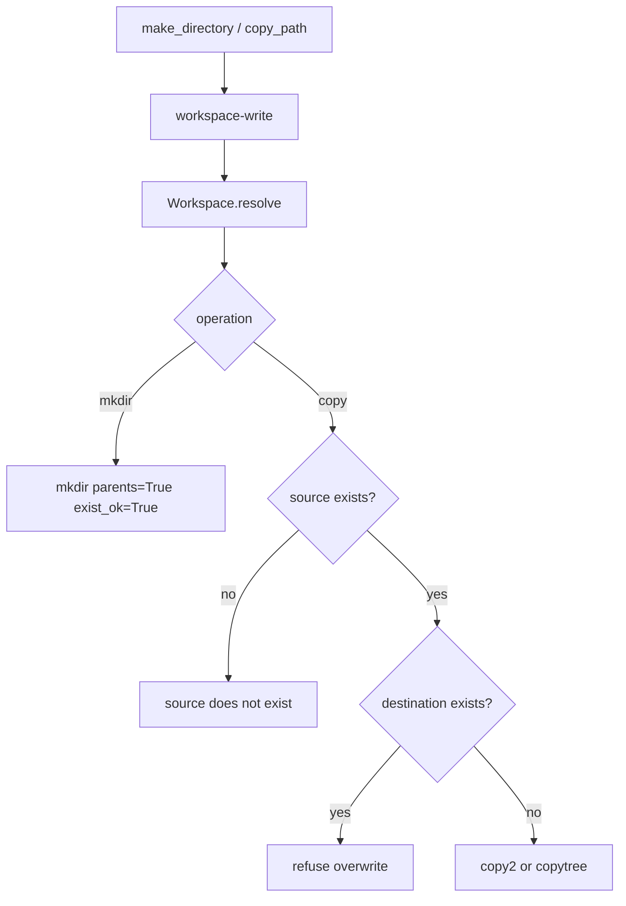

# 059-工具层-Filesystem-Directory And Copy Tools

## 中文版：补齐创建目录和复制路径

### 全局作用

参见：[000-总览-Harness-分层架构与连载目录](000-总览-Harness-分层架构与连载目录.md)。本文位于工具层的 Filesystem Tools 分支。

Directory And Copy Tools 增加 `make_directory` 和 `copy_path`。它们让 Agent 能创建目录结构、复制模板、备份文件或复制整个目录，而不必借助 shell。

### 输入 / 输出 / 行为

- 输入：`make_directory.path`，或 `copy_path.source/destination`。
- 输出：创建或复制结果。
- 行为：
  - 所有路径经过 workspace guard。
  - make_directory 支持 parents。
  - copy_path 支持文件和目录。
  - destination 已存在时拒绝覆盖。
  - 需要 `workspace-write` 权限。
- 失败模式：source 不存在、destination 已存在、路径逃逸、权限不足会失败。

### 实现原理与流程图

复制工具保守地拒绝覆盖已有目标，避免模型误覆盖重要文件；目录创建则幂等。



### 当前实现

| 项 | 状态 |
|---|---|
| 层 | 工具层 |
| 模块 | Filesystem |
| 子模块 | Directory And Copy Tools |
| 实现状态 | 已实现 |
| 对应提交 | `79fd43b Add directory and copy tools` |

- 工具：`make_directory`、`copy_path`
- 权限：`workspace-write`
- Profile：`coding`

### 横向对标

| Harness | 对应实现 | 实现原理 |
|---|---|---|
| Claude Code | file edit、Bash / PowerShell | 目录/复制可用 shell 完成，但专用工具更容易治理。 |
| Codex | file tools、unified exec | 文件工具减少对危险执行工具的依赖。 |
| OpenClaw | filesystem bridge | 文件复制在远端/容器环境要经过 bridge。 |
| Hermes Agent | local/Docker/SSH sandbox、checkpoint | 复制和目录操作应与 sandbox 和 checkpoint 一起治理。 |

本仓库优先把常见文件操作做成内置工具，是为了让高风险 shell 使用频率下降。

### 测试例跑法

```bash
PYTHONPATH=src python3 -m pytest tests/test_tools_workspace.py::test_make_directory_creates_nested_directories tests/test_tools_workspace.py::test_copy_path_copies_files_and_directories_inside_workspace tests/test_tools_workspace.py::test_copy_path_refuses_existing_destination -q
```

读者验证点：目录可创建，文件/目录可复制，已有目标不会被覆盖。

### 后续扩展

- 支持 copy overwrite 但需审批。
- 复制前后登记 artifact。
- 支持模板目录复制。

## English Version

Directory and copy tools provide safe workspace-scoped structure creation and
copying without requiring shell execution.
