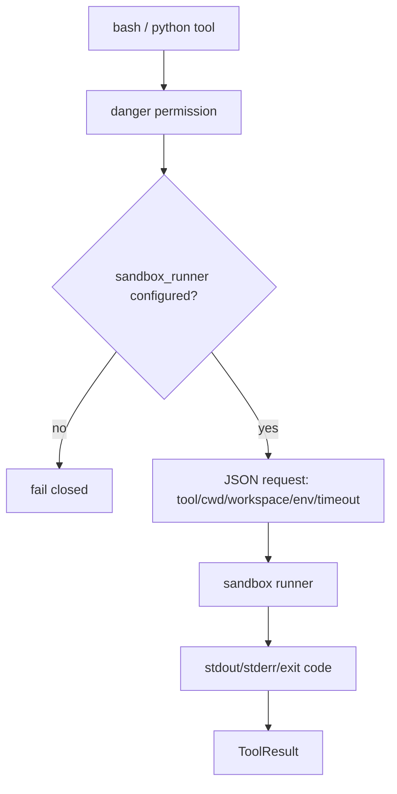

# 060-工具层-Execution-Sandbox Required

## 中文版：高风险执行工具没有沙箱就拒绝运行

### 全局作用

参见：[000-总览-Harness-分层架构与连载目录](000-总览-Harness-分层架构与连载目录.md)。本文位于工具层和执行安全基础设施层交界处。

Sandbox Required 落实 Phase 1 的安全原则：runtime 本身不做强隔离，但 `bash` 和 `python` 这类高风险执行工具必须经过 sandbox runner。runner 缺失时 fail closed，不能 fallback 到宿主机裸跑。

### 输入 / 输出 / 行为

- 输入：bash/python tool call、sandbox_runner 配置。
- 输出：执行结果，或 `sandbox runner is required` 错误。
- 行为：
  - 工具 metadata 标记 `sandbox_required=true`。
  - handler 检查 `_sandbox_runner`。
  - 缺失 runner 直接返回错误。
  - 有 runner 时通过 JSON request 调用。
- 失败模式：runner 缺失、runner 不存在、runner 超时、命令非零退出都返回 tool error。

### 实现原理与流程图

执行工具不直接调用 shell/python，而是构建 request 交给 runner。这样安全边界集中在工具调用层。



### 当前实现

| 项 | 状态 |
|---|---|
| 层 | 工具层 / 执行与安全基础设施 |
| 模块 | Execution |
| 子模块 | Sandbox Required |
| 实现状态 | 已实现 |
| 对应提交 | `2213f39 Require sandbox runner for execution tools` |

- 工具：`bash`、`python`
- 配置：`sandbox_runner`
- Metadata：`sandbox_required=true`

### 横向对标

| Harness | 对应实现 | 实现原理 |
|---|---|---|
| Claude Code | Bash / PowerShell、permission hooks、worktree isolation | 执行工具受权限模式和环境隔离共同约束。 |
| Codex | platform sandbox、unified exec、exec-server | 高风险执行统一进入 sandbox/exec server，不直接裸跑。 |
| OpenClaw | Docker / SSH / OpenShell sandbox、exec approval | 执行必须穿过 sandbox 和审批边界。 |
| Hermes Agent | local / Docker / SSH / Singularity / Modal / Daytona sandbox | 多 sandbox backend 承载同一执行工具语义。 |

本仓库采用轻量工具级沙箱策略：文件工具走 path guard，执行工具必须走 runner。这和此前工具层结论一致。

### 测试例跑法

```bash
PYTHONPATH=src python3 -m pytest tests/test_tools_workspace.py::test_bash_requires_danger_permission tests/test_tools_workspace.py::test_bash_runs_through_configured_sandbox_runner tests/test_tools_workspace.py -k sandbox_required -q
```

读者验证点：danger 权限允许但没有 runner 时仍拒绝；配置 runner 后才执行；metadata 标记执行工具需要 sandbox。

### 后续扩展

- 增加浏览器自动化 runner。
- 将 sandbox result 写入 audit。
- 支持 per-tool sandbox policy 和 resource limit。

## English Version

Execution tools fail closed without a sandbox runner. This keeps high-risk
commands behind a tool-level isolation boundary instead of running directly on
the host.
