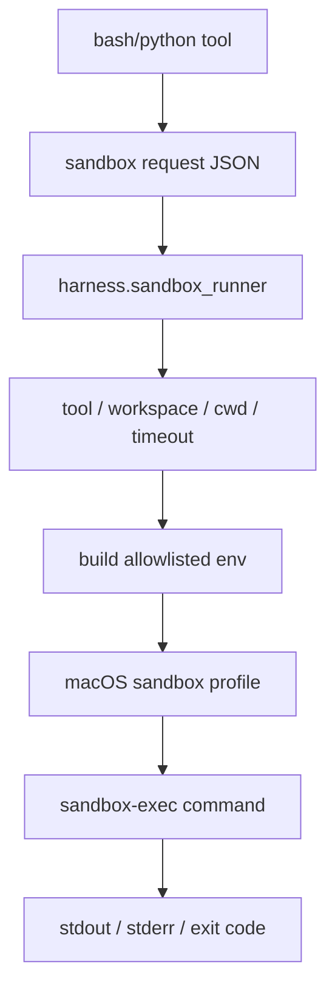

# 061-执行层-Sandbox-Built In Local Runner

## 中文版：本地执行工具有一个默认沙箱入口

### 全局作用

参见：[000-总览-Harness-分层架构与连载目录](000-总览-Harness-分层架构与连载目录.md)。本文位于执行与安全基础设施层的 Sandbox Runner 分支。

Built In Local Runner 提供 `python3 -m harness.sandbox_runner`，作为 Phase 1 本地 harness 的默认轻量沙箱。它使用 macOS `sandbox-exec` 限制写入范围，拒绝读取常见敏感目录，并校验 cwd 必须在 workspace 内。

### 输入 / 输出 / 行为

- 输入：JSON request，包含 tool、command/code、cwd、workspace_root、env、timeout_seconds。
- 输出：子进程 stdout/stderr 和退出码。
- 行为：
  - 只支持 `bash` 和 `python`。
  - workspace 和 cwd 必须是已存在目录。
  - cwd 必须在 workspace 内。
  - 环境变量只保留 allowlist 和显式 env。
  - macOS 上通过 `sandbox-exec` 执行。
- 失败模式：非 macOS、缺少 sandbox-exec、cwd 逃逸、超时、敏感路径读取都会失败。

### 实现原理与流程图

runner 是工具层和宿主机之间的执行边界。工具把执行意图序列化成 request，runner 负责解释 request 并应用平台沙箱。



### 当前实现

| 项 | 状态 |
|---|---|
| 层 | 执行与安全基础设施 |
| 模块 | Sandbox |
| 子模块 | Built In Local Runner |
| 实现状态 | 已实现 |
| 对应提交 | `b0357a6 Add built-in local sandbox runner` |

- 模块：`harness.sandbox_runner`
- 默认配置：`python3 -m harness.sandbox_runner`
- 平台：macOS `sandbox-exec`

### 横向对标

| Harness | 对应实现 | 实现原理 |
|---|---|---|
| Claude Code | sandbox adapter、permission hooks、worktree isolation | 沙箱与权限 hook、工作区隔离共同限制执行影响面。 |
| Codex | platform sandbox、unified exec、exec-server | 执行统一交给 sandbox/exec server，而不是 runtime 裸跑。 |
| OpenClaw | Docker / SSH / OpenShell sandbox | 通过不同执行后端隔离宿主资源。 |
| Hermes Agent | local / Docker / SSH / Singularity / Modal / Daytona sandbox | 多后端 sandbox 统一承载工具执行。 |

本仓库先实现 macOS 本地轻量 runner，符合 Phase 1 工具级沙箱策略；后续再接 Docker、远端 runner 和浏览器 runner。

### 测试例跑法

```bash
PYTHONPATH=src python3 -m pytest tests/test_sandbox_runner.py -q
```

读者验证点：runner 能在 workspace 内执行 bash/python，拒绝 cwd 逃逸、敏感读取和 workspace 外写入。

### 后续扩展

- 增加 Linux sandbox 后端。
- 输出结构化 sandbox result。
- 将 sandbox 拒绝写入 audit。

## English Version

The built-in local runner gives execution tools a default macOS sandbox boundary
for Phase 1 local harness use.
