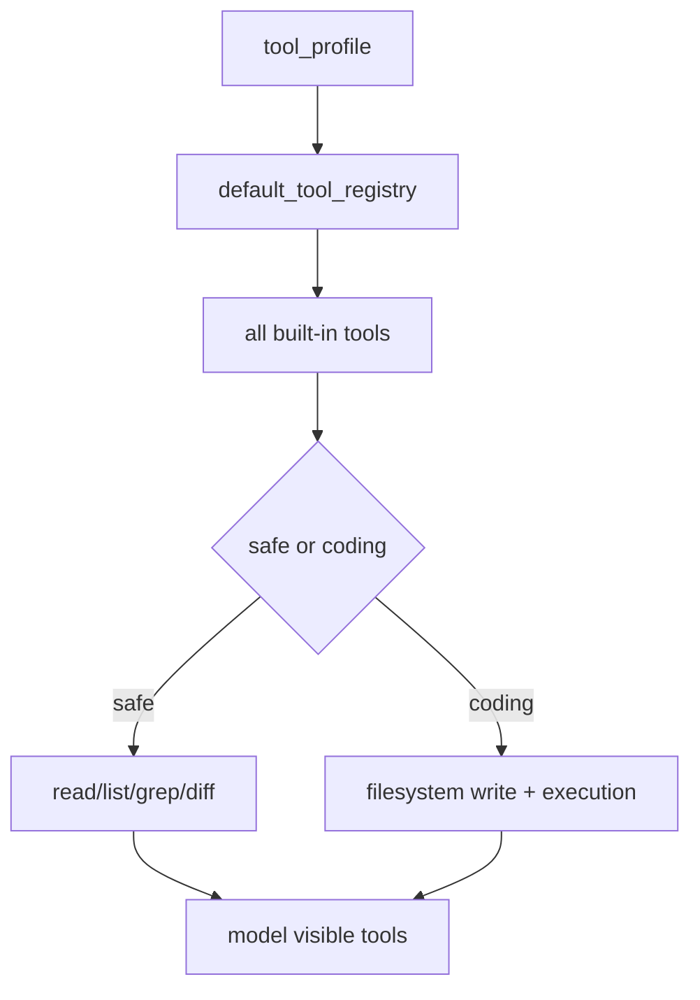

# 062-工具层-Tools-Configurable Profiles

## 中文版：不同角色看到不同工具集

### 全局作用

参见：[000-总览-Harness-分层架构与连载目录](000-总览-Harness-分层架构与连载目录.md)。本文位于工具层和 Agent Control Plane 的 Tool Profile 分支。

Configurable Profiles 提供 `safe` 和 `coding` 两档工具 profile。探索型 Agent 可以只拿只读工具，编码型 Agent 才拿写入和执行工具。工具可见性是权限之外的另一层控制面。

### 输入 / 输出 / 行为

- 输入：`tool_profile` 配置或 CLI 参数。
- 输出：过滤后的 ToolRegistry。
- 行为：
  - `safe` 只包含 read/list/grep/diff。
  - `coding` 包含文件写入、移动、复制、删除、bash、python。
  - 未知 profile 直接报错。
  - config validation 检查 profile 合法性。
- 失败模式：未知 profile 会失败；profile 过滤后不存在的工具不可调用。

### 实现原理与流程图

registry 先注册完整工具集，再按 profile 名称过滤。权限仍然独立生效，profile 只决定“是否可见”。



### 当前实现

| 项 | 状态 |
|---|---|
| 层 | 工具层 / Agent Control Plane |
| 模块 | Tools |
| 子模块 | Configurable Profiles |
| 实现状态 | 已实现 |
| 对应提交 | `aabe2ad Add configurable tool profiles` |

- Profiles：`safe`、`coding`
- 配置：`tool_profile`、`HARNESS_TOOL_PROFILE`
- CLI：`--tool-profile`

### 横向对标

| Harness | 对应实现 | 实现原理 |
|---|---|---|
| Claude Code | tool pool、permission modes、MCP config scopes | 工具可见性与权限模式、MCP scope 共同决定模型能力。 |
| Codex | permission profile、ToolRouter、agent roles | 不同 profile/role 装配不同工具路由。 |
| OpenClaw | skills gating、auth profiles、plugin registry | 工具能力受角色、插件和授权资料控制。 |
| Hermes Agent | toolsets、tool registry、skills hub | toolset 是工具组合和角色能力边界。 |

本仓库先以两个 profile 暴露工具可见性控制，后续会演进到角色、MCP、skill-provided tools。

### 测试例跑法

```bash
PYTHONPATH=src python3 -m pytest tests/test_tools_workspace.py::test_tool_registry_can_apply_safe_profile tests/test_tools_workspace.py::test_tool_registry_can_apply_coding_profile tests/test_tools_workspace.py::test_tool_registry_rejects_unknown_profile tests/test_config.py::test_config_validate_reports_errors_and_warnings -q
```

读者验证点：safe profile 不包含写入/执行工具；coding profile 包含完整本地编码工具。

### 后续扩展

- 支持自定义 tool profile。
- profile 绑定 agent role。
- profile 与 sandbox policy 联动。

## English Version

Configurable tool profiles separate tool visibility from permission checks,
letting different agent roles receive different tool sets.
