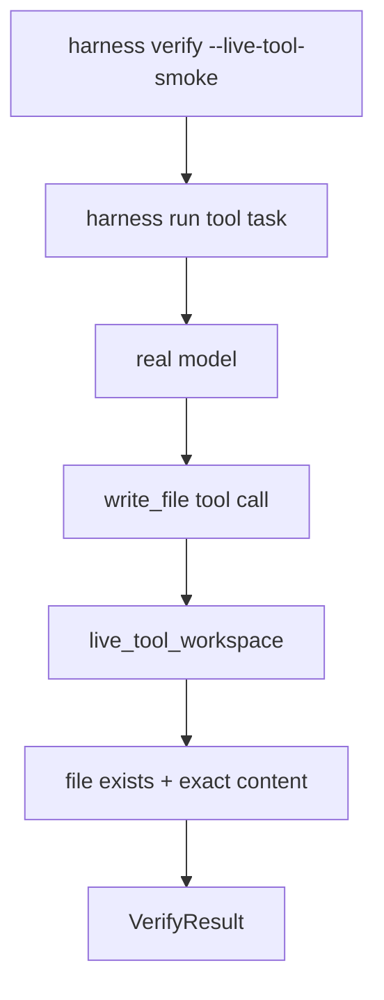

# 063-验证层-Verify-Live Tool Smoke

## 中文版：真实模型不仅要回答，还要会用工具

### 全局作用

参见：[000-总览-Harness-分层架构与连载目录](000-总览-Harness-分层架构与连载目录.md)。本文位于验证层的 Verify 分支。

Live Tool Smoke 用真实模型执行一个最小工具任务：创建 `live-tool-smoke.txt`。它验证的不只是模型 endpoint，而是模型 tool calling、Kernel loop、文件工具、session、trace、audit 的端到端链路。

### 输入 / 输出 / 行为

- 输入：真实模型配置、`harness verify --live-tool-smoke`。
- 输出：verify report 中的 `live_tool_smoke`。
- 行为：
  - 缺少 base_url/api_key 时失败。
  - 启动 `harness run`，要求模型用工具创建文件。
  - 检查目标文件存在且内容等于 `live-tool-smoke-ok`。
- 失败模式：模型不调用工具、文件缺失、内容不匹配、API 错误都会失败。

### 实现原理与流程图

Live tool smoke 是真实模型链路的强验证，比只看 final text 更接近实际 harness 使用场景。



### 当前实现

| 项 | 状态 |
|---|---|
| 层 | 验证层 |
| 模块 | Verify |
| 子模块 | Live Tool Smoke |
| 实现状态 | 已实现 |
| 对应提交 | `73e5f54 Add live tool smoke verification` |

- 模块：`harness.verify._run_live_tool_smoke`
- CLI：`harness verify --live-tool-smoke`

### 横向对标

| Harness | 对应实现 | 实现原理 |
|---|---|---|
| Claude Code | doctor、VCR fixtures、tool executor | 工具调用链路需要单独验证，而不是只测模型回答。 |
| Codex | rollout trace、tests、doctor | tool smoke 可从 rollout 中派生回归样本。 |
| OpenClaw | diagnostic events、gateway health | 多节点工具链路需要跨 gateway 验证。 |
| Hermes Agent | batch runner、trajectories、doctor | live tool 任务可作为 trajectory eval。 |

本仓库默认不运行 live tool smoke，避免费用和网络依赖；需要真实模型验收时再显式开启。

### 测试例跑法

```bash
PYTHONPATH=src python3 -m pytest tests/test_verify.py::test_live_tool_smoke_requires_created_file tests/test_verify.py::test_live_tool_smoke_passes_when_model_created_file -q
```

真实模型验证示例：

```bash
HARNESS_BASE_URL=https://api.deepseek.com HARNESS_API_KEY=*** HARNESS_MODEL=deepseek-v4-pro PYTHONPATH=src python3 -m harness.cli verify --work-dir /private/tmp/harness_verify_live_tool --live-tool-smoke --skip-tests --skip-compile --skip-config-validation
```

读者验证点：模型必须真实创建文件，只有 final answer 不够。

### 后续扩展

- 增加多工具 live smoke。
- 生成 live trace golden case。
- 区分模型不会用工具与工具执行失败。

## English Version

Live tool smoke verifies real model tool use end to end, not just model text
generation.
