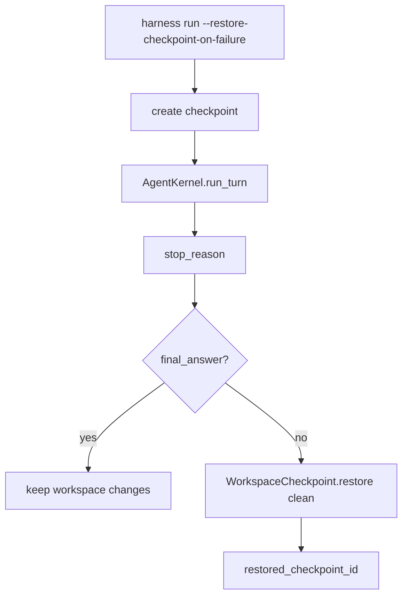

# 064-执行层-Checkpoint-Rollback Failed Runs

## 中文版：运行失败后自动回滚工作区

### 全局作用

参见：[000-总览-Harness-分层架构与连载目录](000-总览-Harness-分层架构与连载目录.md)。本文位于执行与安全基础设施层的 Checkpoint 分支。

Rollback Failed Runs 让 `harness run --restore-checkpoint-on-failure` 在运行前创建 checkpoint，并在 stop reason 不是 `final_answer` 时 clean restore。它让实验性工具调用失败后不会污染 workspace。

### 输入 / 输出 / 行为

- 输入：run prompt、workspace、checkpoint dir、`--restore-checkpoint-on-failure`。
- 输出：run result 和可选 restored checkpoint id。
- 行为：
  - run 前创建 checkpoint。
  - Kernel 执行 turn。
  - 如果失败，执行 clean restore。
  - JSON 输出包含 checkpoint_manifest 和 restored_checkpoint_id。
- 失败模式：checkpoint 创建失败或 restore 失败会暴露错误；成功 run 不回滚。

### 实现原理与流程图

rollback 位于 CLI 编排层，因为它需要包住整个 Kernel turn，而不是某个工具调用。



### 当前实现

| 项 | 状态 |
|---|---|
| 层 | 执行与安全基础设施 |
| 模块 | Checkpoint |
| 子模块 | Rollback Failed Runs |
| 实现状态 | 已实现 |
| 对应提交 | `a41fd0a Add checkpoint rollback for failed runs` |

- CLI：`harness run --restore-checkpoint-on-failure`
- 相关模块：`WorkspaceCheckpoint.create`、`restore(clean=True)`

### 横向对标

| Harness | 对应实现 | 实现原理 |
|---|---|---|
| Claude Code | worktree isolation、file edit rollback | 失败影响通常被限制在 worktree 或编辑事务中。 |
| Codex | platform sandbox、exec-server、state DB | 失败运行应能通过状态和 sandbox 回滚。 |
| OpenClaw | Docker / SSH / OpenShell sandbox | 失败任务可丢弃容器/远端临时环境。 |
| Hermes Agent | checkpoint、trajectory、batch runner | 失败 rollback 与 trajectory 复盘结合。 |

本仓库用文件 checkpoint 包住本地 run，是最小可验证的失败恢复策略。

### 测试例跑法

```bash
PYTHONPATH=src python3 -m pytest tests/test_cli_smoke.py::test_cli_run_can_restore_checkpoint_on_failure tests/test_cli_smoke.py::test_cli_run_keeps_changes_after_successful_checkpointed_run -q
```

读者验证点：失败 run 后临时文件消失，成功 run 后变更保留。

### 后续扩展

- rollback 前输出 diff。
- 失败回滚写入 audit。
- 支持 per-tool checkpoint。

## English Version

Rollback failed runs wraps a kernel turn in a checkpoint and clean-restores the
workspace when the turn does not finish successfully.
