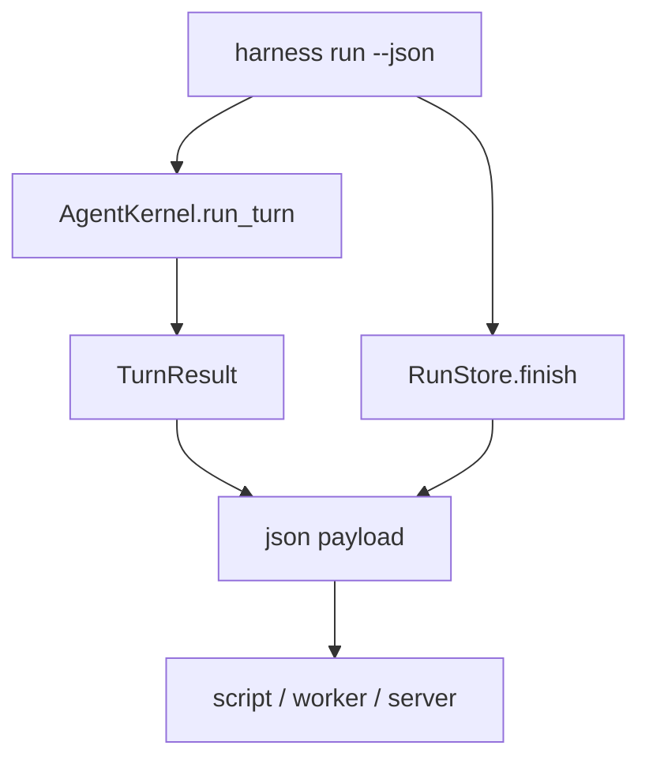

# 065-体验层-Run-JSON Output

## 中文版：运行结果要能被程序消费

### 全局作用

参见：[000-总览-Harness-分层架构与连载目录](000-总览-Harness-分层架构与连载目录.md)。本文位于体验层和可观测层交界处。

Run JSON Output 让 `harness run --json` 输出结构化结果，包含 final_text、run_id、session_id、turn_id、iterations、stop_reason、checkpoint 信息。它让脚本、CI、队列 worker 和后续 server 能稳定消费运行结果。

### 输入 / 输出 / 行为

- 输入：`harness run ... --json`。
- 输出：JSON object。
- 行为：
  - 正常和失败都输出结构化字段。
  - 包含 run/session/turn 关联字段。
  - checkpoint 模式下包含 checkpoint id 和 manifest。
  - CLI 退出码仍按 stop reason 表达成功/失败。
- 失败模式：命令参数错误或配置错误会在 JSON 输出前失败。

### 实现原理与流程图

CLI 从 Kernel result 和 RunStore record 组装 JSON，避免调用方解析人类可读文本。



### 当前实现

| 项 | 状态 |
|---|---|
| 层 | Experience & Gateway |
| 模块 | Run |
| 子模块 | JSON Output |
| 实现状态 | 已实现 |
| 对应提交 | `086678e Add JSON output for run results` |

- CLI：`harness run --json`
- 字段：`final_text`、`run_id`、`session_id`、`turn_id`、`iterations`、`stop_reason`

### 横向对标

| Harness | 对应实现 | 实现原理 |
|---|---|---|
| Claude Code | print mode、SDK streams | 面向程序消费时需要稳定协议而非 TUI 文本。 |
| Codex | codex exec、SDK、app server | exec/server 输出结构化结果给上层系统。 |
| OpenClaw | Gateway WS / HTTP、messaging channels | 消息通道天然需要结构化 payload。 |
| Hermes Agent | OpenAI-format API server、batch runner | API/batch 入口依赖结构化结果。 |

本仓库先用 CLI JSON 输出建立协议雏形，后续 server 可复用字段。

### 测试例跑法

```bash
PYTHONPATH=src python3 -m pytest tests/test_cli_smoke.py::test_cli_run_can_emit_json_result tests/test_cli_smoke.py::test_cli_run_json_result_includes_checkpoint_restore -q
```

读者验证点：JSON 中有 session_id、turn_id、stop_reason 和 checkpoint 信息。

### 后续扩展

- JSON schema 固化。
- 支持 streaming JSONL events。
- 与 run queue worker 输出统一。

## English Version

Run JSON output gives scripts and future servers a stable structured result
instead of human-oriented CLI text.
