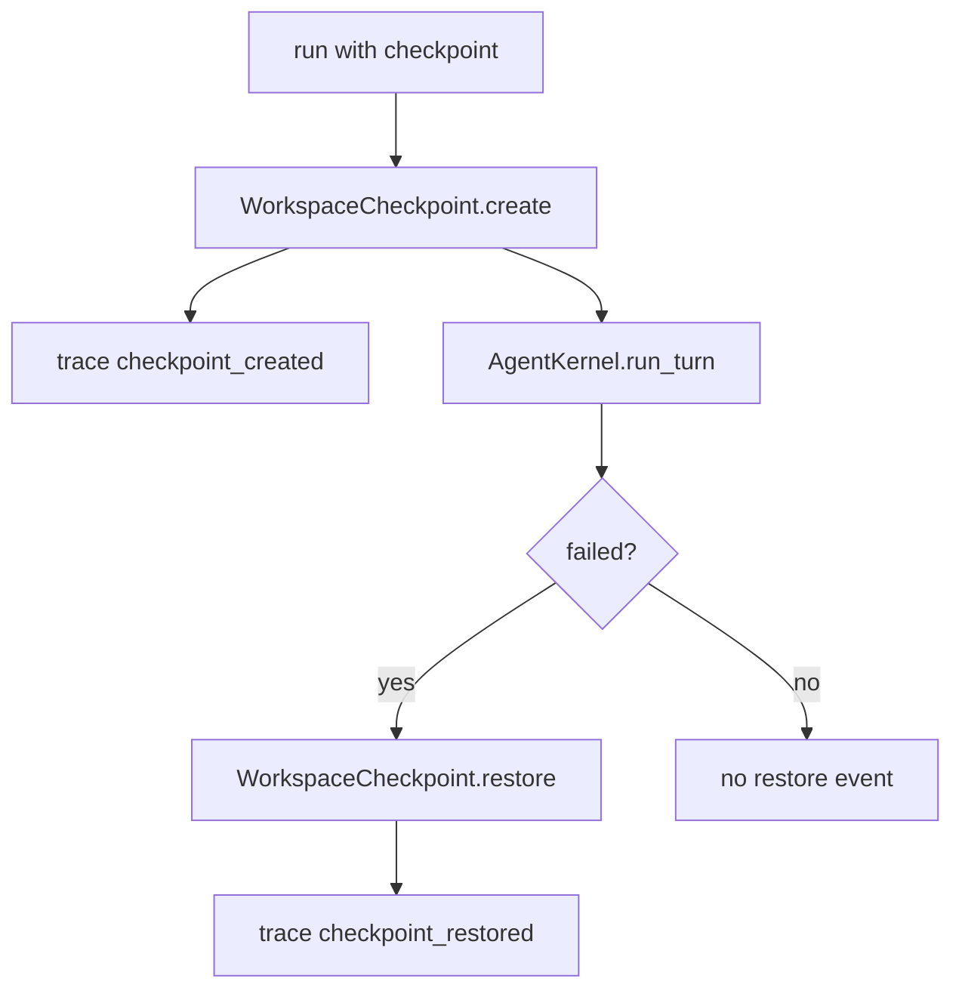

# 066-可观测层-Trace-Checkpoint Lifecycle Events

## 中文版：checkpoint 创建和恢复也要进入 trace

### 全局作用

参见：[000-总览-Harness-分层架构与连载目录](000-总览-Harness-分层架构与连载目录.md)。本文位于可观测层的 Trace 分支。

Checkpoint Lifecycle Events 将 checkpoint 创建和恢复记录到 trace：`checkpoint_created`、`checkpoint_restored`。这样复盘一次 run 时，可以知道工作区在什么时候被保护、什么时候被回滚。

### 输入 / 输出 / 行为

- 输入：checkpoint create/restore 操作。
- 输出：trace JSONL 中的 lifecycle event。
- 行为：
  - 创建 checkpoint 时记录 id、manifest、label、files、workspace。
  - 失败回滚时记录 restored checkpoint id、manifest、workspace、stop reason。
  - trace summary 统计 checkpoint 数量。
- 失败模式：trace path 未配置时跳过；checkpoint 操作失败时不会写成功事件。

### 实现原理与流程图

checkpoint lifecycle 在 CLI 编排层记录，因为 checkpoint 包住整个 run。



### 当前实现

| 项 | 状态 |
|---|---|
| 层 | 可观测层 |
| 模块 | Trace |
| 子模块 | Checkpoint Lifecycle Events |
| 实现状态 | 已实现 |
| 对应提交 | `e0cfe0f Trace checkpoint lifecycle events` |

- Events：`checkpoint_created`、`checkpoint_restored`
- Summary 字段：`checkpoints`、`checkpoint_restores`

### 横向对标

| Harness | 对应实现 | 实现原理 |
|---|---|---|
| Claude Code | worktree/session lifecycle、analytics | 执行保护动作需要进入运行轨迹。 |
| Codex | rollout trace、state DB | checkpoint/restore 应与 rollout 和 state 关联。 |
| OpenClaw | diagnostic events、security audit | 多节点恢复动作需要诊断事件。 |
| Hermes Agent | trajectory、checkpoint、batch runner | checkpoint lifecycle 是 trajectory 的关键节点。 |

本仓库先记录 checkpoint lifecycle 到 trace，后续会与 artifact、audit、run id 进一步关联。

### 测试例跑法

```bash
PYTHONPATH=src python3 -m pytest tests/test_cli_smoke.py::test_cli_run_records_checkpoint_lifecycle_in_trace tests/test_trace_cli.py::test_trace_recorder_summarizes_events -q
```

读者验证点：trace 中能看到 checkpoint_created 和 checkpoint_restored，并被 summary 统计。

### 后续扩展

- 写入 run_id 和 turn_id。
- restore 前后 diff 进入 trace。
- checkpoint artifact 与 trace event 互链。

## English Version

Checkpoint lifecycle events make recovery boundaries visible in trace data.
