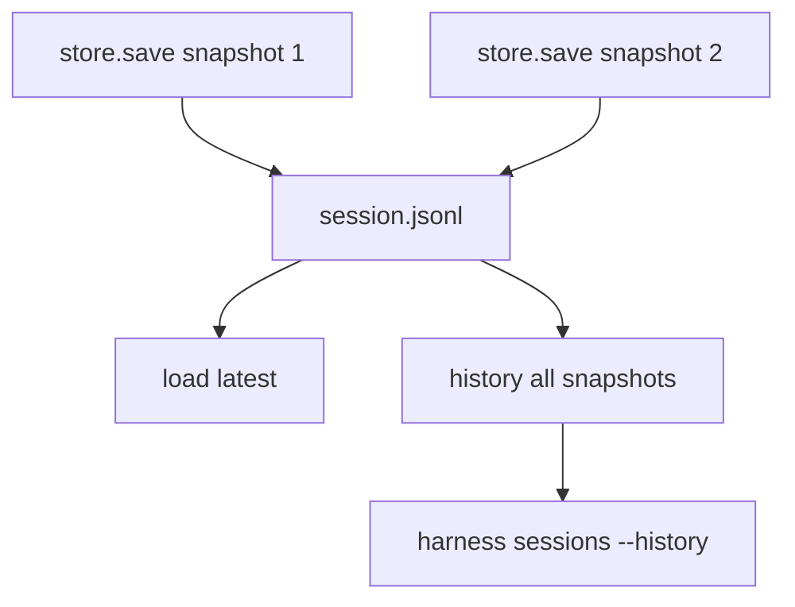

# 067-状态层-Session-Snapshot History View

## 中文版：会话是追加快照，不是单个文件覆盖

### 全局作用

参见：[000-总览-Harness-分层架构与连载目录](000-总览-Harness-分层架构与连载目录.md)。本文位于状态层的 Session Store 分支。

Snapshot History View 让 `JsonlSessionStore` 可以读取一个 session 的所有历史快照，并通过 CLI `harness sessions --history` 查看。每次 save 都追加一行 JSON，保留会话演进过程。

### 输入 / 输出 / 行为

- 输入：session id。
- 输出：session snapshot 列表或摘要。
- 行为：
  - `save()` append snapshot。
  - `load()` 读取最后一个 snapshot。
  - `history()` 读取全部 snapshot。
  - CLI 可输出文本摘要或 JSON。
- 失败模式：session 不存在时报错；JSONL 损坏会暴露解析错误。

### 实现原理与流程图

append-only session store 让状态变化可追溯，尤其适合 compact、resume、handoff 等操作。



### 当前实现

| 项 | 状态 |
|---|---|
| 层 | 状态层 |
| 模块 | Session |
| 子模块 | Snapshot History View |
| 实现状态 | 已实现 |
| 对应提交 | `e880e5a Append session snapshots with history view` |

- 模块：`JsonlSessionStore.history`
- CLI：`harness sessions --history <session-id> --json`

### 横向对标

| Harness | 对应实现 | 实现原理 |
|---|---|---|
| Claude Code | session memory、context compact、remote/direct sessions | 会话历史服务恢复、压缩和接力。 |
| Codex | history manager、state DB | 历史快照支撑 resume、trace reducer 和桌面状态。 |
| OpenClaw | session routing、subagent session protocol | 多通道 session 需要可追踪历史。 |
| Hermes Agent | state.db、FTS5 session search | 会话历史进入数据库和检索系统。 |

本仓库用 JSONL 快照保留历史，简单透明，适合本地 harness。

### 测试例跑法

```bash
PYTHONPATH=src python3 -m pytest tests/test_session_context.py::test_jsonl_session_store_loads_history tests/test_session_context.py::test_cli_sessions_can_show_snapshot_history -q
```

读者验证点：同一 session 多次 save 后，history 能看到每个快照的消息数量。

### 后续扩展

- 支持快照 diff。
- 支持按 turn_id 定位快照。
- 历史压缩与归档。

## English Version

Session snapshot history keeps local sessions append-only and inspectable over
time.
