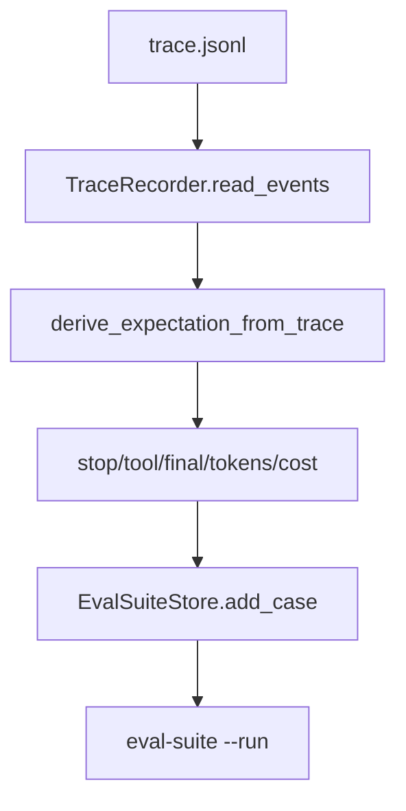

# 068-评测层-EvalSuite-Derive Golden From Trace

## 中文版：从真实轨迹生成回归用例

### 全局作用

参见：[000-总览-Harness-分层架构与连载目录](000-总览-Harness-分层架构与连载目录.md)。本文位于评测层的 Eval Suite 分支。

Derive Golden From Trace 将已有 trace 自动提炼成 expectation：stop reason、tool errors、required tools、final text、token 和 cost。它把一次成功或重要运行变成可重复验证的 golden case。

### 输入 / 输出 / 行为

- 输入：trace JSONL、case name。
- 输出：suite case with derived expectation。
- 行为：
  - 读取最后一个 turn_end 的 stop reason 和 final text。
  - 统计 tool errors 和 required tools。
  - 统计 token 和 cost 上限。
  - 写入 eval suite。
- 失败模式：trace 为空时 expectation 可能缺少 stop reason；suite 文件损坏时报错。

### 实现原理与流程图

派生逻辑只读取 trace，不重跑模型，因此稳定且便宜。它适合把调试中发现的关键轨迹保存成回归样本。



### 当前实现

| 项 | 状态 |
|---|---|
| 层 | 评测层 |
| 模块 | EvalSuite |
| 子模块 | Derive Golden From Trace |
| 实现状态 | 已实现 |
| 对应提交 | `f48d621 Derive golden cases from traces` |

- 模块：`derive_expectation_from_trace`、`EvalSuiteStore.add_case_from_trace`
- CLI：`harness eval-suite <suite> --add-from-trace <name> --trace-path <trace>`

### 横向对标

| Harness | 对应实现 | 实现原理 |
|---|---|---|
| Claude Code | VCR fixtures、analytics | 真实会话可转成回放/回归样本。 |
| Codex | rollout trace、trace reducer、tests | 从 rollout 轨迹中提炼 eval case 是核心评测路径。 |
| OpenClaw | diagnostic events、cache trace | 多节点诊断事件可沉淀为回归任务。 |
| Hermes Agent | trajectories、batch runner | trajectory 天然适合派生 batch eval。 |

本仓库先从本地 trace 派生 golden，后续可加入 trace reducer 和 live replay。

### 测试例跑法

```bash
PYTHONPATH=src python3 -m pytest tests/test_replay_eval.py::test_eval_suite_can_add_case_from_trace tests/test_regression_doctor.py::test_cli_eval_suite_add_list_and_run -q
```

读者验证点：从 trace 添加 case 后，suite 中包含 required tools 和 final text expectation。

### 后续扩展

- 支持人工编辑派生规则。
- 支持失败 trace 自动分类。
- 支持从多 trace 批量生成 suite。

## English Version

Deriving golden cases from traces turns real runtime trajectories into stable
regression cases without re-running the model.
