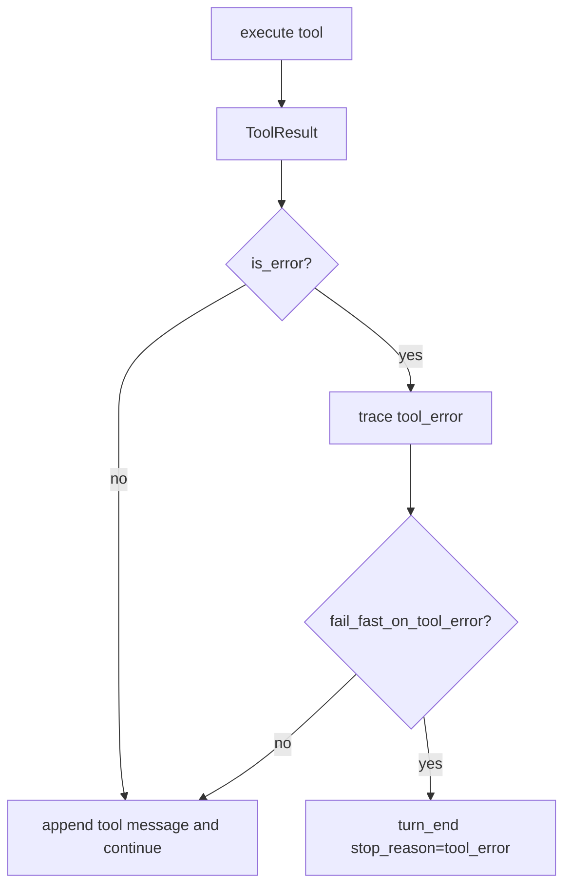

# 069-运行时层-Kernel-Fail Fast Tool Error

## 中文版：工具错了可以立刻停

### 全局作用

参见：[000-总览-Harness-分层架构与连载目录](000-总览-Harness-分层架构与连载目录.md)。本文位于 Harness Runtime 的 Kernel 分支。

Fail Fast Tool Error 让 Kernel 在工具返回错误后可选择立即停止 turn，而不是继续执行同一批或下一轮模型调用。它适合安全敏感或测试严格的运行模式。

### 输入 / 输出 / 行为

- 输入：`fail_fast_on_tool_error` 配置。
- 输出：stop reason `tool_error`。
- 行为：
  - 工具错误仍写入 trace。
  - 开启 fail fast 后立即结束 turn。
  - 关闭时保持原有循环策略。
  - CLI/config/env 都可配置。
- 失败模式：工具错误本身来自权限、参数、sandbox、handler exception。

### 实现原理与流程图

Kernel 在每个 tool call 后检查 `result.is_error`。fail fast 是 runtime policy，不放在工具内部。



### 当前实现

| 项 | 状态 |
|---|---|
| 层 | Harness Runtime |
| 模块 | Kernel |
| 子模块 | Fail Fast Tool Error |
| 实现状态 | 已实现 |
| 对应提交 | `e453e49 Add fail-fast tool error mode` |

- 配置：`fail_fast_on_tool_error`、`HARNESS_FAIL_FAST_ON_TOOL_ERROR`
- CLI：`harness run --fail-fast-on-tool-error`
- Stop reason：`tool_error`

### 横向对标

| Harness | 对应实现 | 实现原理 |
|---|---|---|
| Claude Code | streaming tool executor、permission modes | 工具错误策略影响模型是否继续修复或立即中断。 |
| Codex | ToolRouter、approval cache、runtime loop | runtime 可以按 profile 控制错误后行为。 |
| OpenClaw | tool streaming、exec approval | 多节点工具错误需要明确是否中断 session。 |
| Hermes Agent | tool executor、batch runner | batch 模式常需要 fail-fast 或 continue-on-error 策略。 |

本仓库将 fail-fast 做成配置项，让测试和安全场景可严格，中等风险场景可让模型自我修复。

### 测试例跑法

```bash
PYTHONPATH=src python3 -m pytest tests/test_kernel.py::test_kernel_can_fail_fast_after_tool_error tests/test_cli_smoke.py::test_cli_run_can_fail_fast_on_tool_error -q
```

读者验证点：开启 fail fast 后第一个工具错误会结束 turn，并留下 `tool_error` trace。

### 后续扩展

- 支持按工具类别 fail-fast。
- 支持 retryable tool error。
- 将 fail-fast 策略纳入 tool profile。

## English Version

Fail-fast tool error mode makes tool failures a runtime stopping condition when
strict execution is desired.
