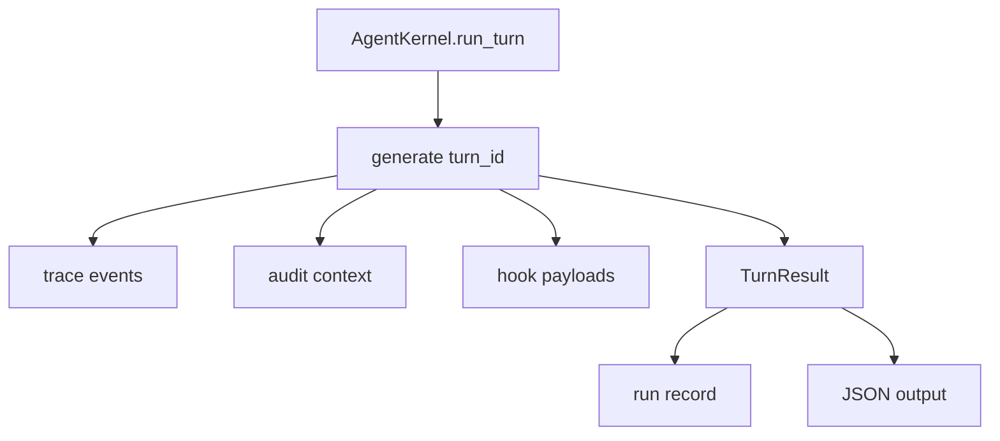

# 070-可观测层-Trace-Turn Identifiers

## 中文版：每一轮运行都要有 turn id

### 全局作用

参见：[000-总览-Harness-分层架构与连载目录](000-总览-Harness-分层架构与连载目录.md)。本文位于可观测层和 Runtime 交界处。

Turn Identifiers 为每次 `run_turn` 生成 `turn_id`，并写入 trace、audit、hooks、run record 和 JSON 输出。它让一次 session 内的多轮操作可以被精确关联和过滤。

### 输入 / 输出 / 行为

- 输入：一次 Kernel turn。
- 输出：TurnResult.turn_id 和各类事件中的 turn_id。
- 行为：
  - turn 开始时生成 UUID。
  - trace 事件带 turn_id。
  - policy audit context 带 turn_id。
  - hooks payload 带 turn_id。
  - CLI JSON 输出带 turn_id。
- 失败模式：如果事件不是由 Kernel turn 产生，可以没有 turn_id；查询时按 turn_id 过滤。

### 实现原理与流程图

turn_id 是 session 内的局部关联键。它不替代 session_id，也不替代 run_id，而是连接一次 turn 内所有事件。



### 当前实现

| 项 | 状态 |
|---|---|
| 层 | 可观测层 / Harness Runtime |
| 模块 | Trace |
| 子模块 | Turn Identifiers |
| 实现状态 | 已实现 |
| 对应提交 | `9a78f39 Add turn identifiers to run traces` |

- 字段：`turn_id`
- 查询：`harness trace --turn <turn-id>`、`harness audit --turn <turn-id>`

### 横向对标

| Harness | 对应实现 | 实现原理 |
|---|---|---|
| Claude Code | query profiler、session analytics、SDK streams | turn/run 关联键是性能诊断和流式事件拼接的基础。 |
| Codex | rollout trace、state DB、run records | turn id 连接采样、工具、approval 和状态变更。 |
| OpenClaw | diagnostic events、session routing | 多通道事件需要 session/turn 级关联。 |
| Hermes Agent | trajectories、usage/cost、logs | trajectory 中每个 step/turn 都要可定位。 |

本仓库把 turn_id 贯穿 trace/audit/run/json，为后续 replay、diagnose 和 server 事件流打基础。

### 测试例跑法

```bash
PYTHONPATH=src python3 -m pytest tests/test_kernel.py::test_kernel_runs_tool_loop_and_persists_trace tests/test_trace_cli.py::test_trace_query_filters_by_session_type_and_limit tests/test_cli_smoke.py::test_cli_run_can_emit_json_result -q
```

读者验证点：trace、audit、hooks 和 JSON 输出中的 turn_id 一致，并可用于过滤。

### 后续扩展

- 引入 step_id/tool_call_id 关联。
- 将 turn_id 加入 checkpoint lifecycle。
- server streaming 事件统一使用 turn_id。

## English Version

Turn identifiers correlate trace, audit, hooks, run records, and JSON output for
one kernel turn inside a session.
