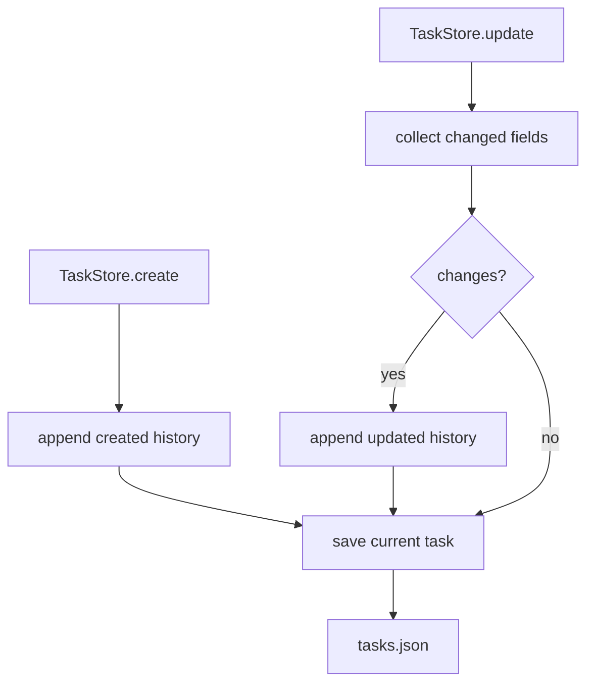

# 071-状态层-Tasks-Task History

## 中文版：任务状态变化要留下历史

### 全局作用

参见：[000-总览-Harness-分层架构与连载目录](000-总览-Harness-分层架构与连载目录.md)。本文位于状态层的 Task Ledger 分支。

Task History 让 task 不只是当前状态，而是有完整变更记录。长程 Agent 需要知道任务什么时候创建、什么时候进入 `in_progress`、什么时候被标记为 `done` 或 `blocked`，这些历史会进入 handoff、diagnose 和后续任务复盘。

### 输入 / 输出 / 行为

- 输入：task create/update 操作。
- 输出：task JSON 中的 `history` 数组。
- 行为：
  - 创建 task 时写入 `created` history。
  - 更新 title、description、status、session、metadata 时写入 `updated` history。
  - `harness tasks --history <id>` 可查看历史。
- 失败模式：task 不存在时报错；没有实际变更时不新增 history。

### 实现原理与流程图

TaskStore 在写入当前状态时同步追加 history event。history 和 task 存在同一个 JSON 结构里，读取和恢复都很直接。



### 当前实现

| 项 | 状态 |
|---|---|
| 层 | 状态层 |
| 模块 | Tasks |
| 子模块 | Task History |
| 实现状态 | 已实现 |
| 对应提交 | `0803a85 Track task history` |

- 模块：`harness.tasks.TaskStore`
- CLI：`harness tasks --history <task-id> --json`

### 横向对标

| Harness | 对应实现 | 实现原理 |
|---|---|---|
| Claude Code | task registry、handoff、session memory | 任务状态与上下文交接绑定，历史用于长程接力。 |
| Codex | state DB、run records、hooks | task/run 历史服务恢复和诊断。 |
| OpenClaw | ACP control plane、session routing | 控制面任务需要状态流转记录。 |
| Hermes Agent | kanban workers、state.db | 看板式 worker 依赖任务历史驱动调度和复盘。 |

本仓库先把 history 存在本地 task ledger 中，后续可拆成 event store。

### 测试例跑法

```bash
PYTHONPATH=src python3 -m pytest tests/test_tasks.py::test_task_store_creates_updates_lists_and_shows_tasks tests/test_tasks.py::test_task_store_history_survives_reload -q
```

读者验证点：任务创建和更新后，history 中保留 created/updated 事件。

### 后续扩展

- 增加 actor、reason 和 source run。
- 支持 task history diff。
- 将 history 纳入 handoff 摘要。

## English Version

Task history records task state transitions so long-running work can be
diagnosed and handed off reliably.
