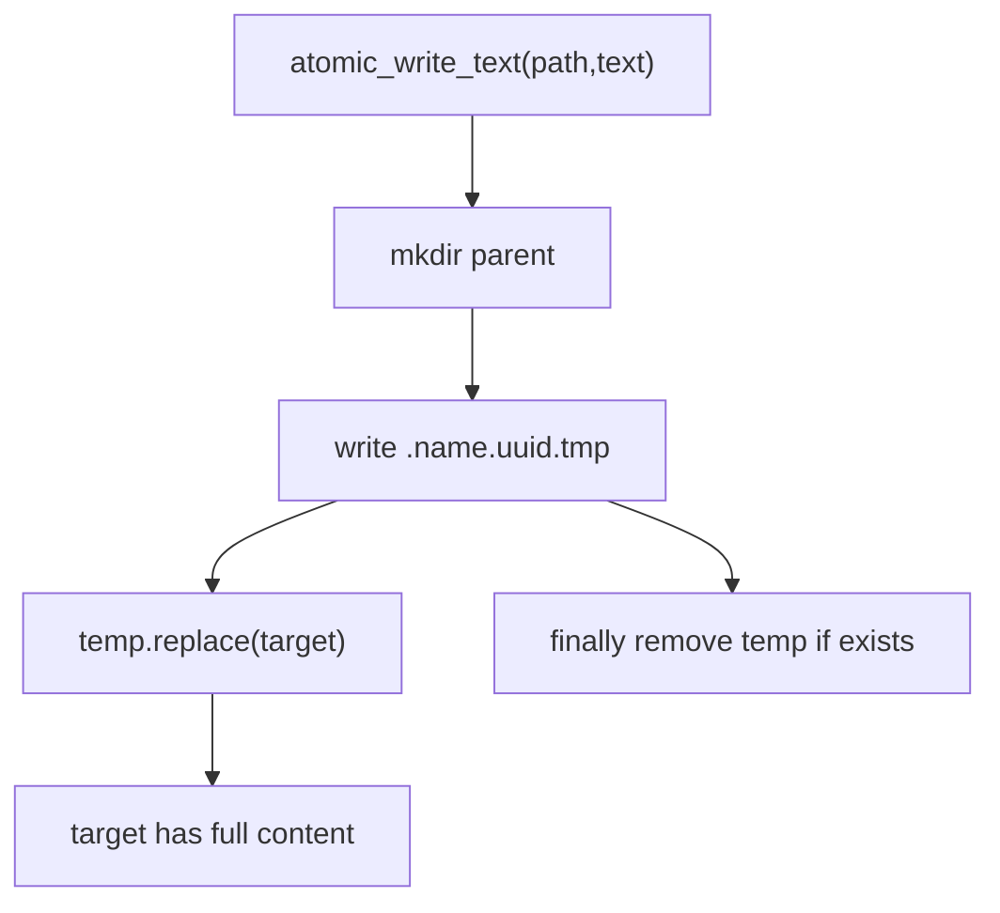

# 072-状态层-Storage-Atomic Writes

## 中文版：状态文件写入不能半截落盘

### 全局作用

参见：[000-总览-Harness-分层架构与连载目录](000-总览-Harness-分层架构与连载目录.md)。本文位于状态层的 Storage 分支。

Atomic Writes 解决本地 JSON/Markdown 状态写入的完整性问题。写状态文件时先写临时文件，再原子替换目标文件，避免进程中断时留下半截 JSON。

### 输入 / 输出 / 行为

- 输入：目标 path、文本内容。
- 输出：写入完成的 path。
- 行为：
  - 自动创建父目录。
  - 写入同目录临时文件。
  - 使用 replace 原子替换目标。
  - finally 清理残留临时文件。
- 失败模式：磁盘权限或路径错误会抛出异常；目标文件保持旧状态或新状态，不应出现半写入。

### 实现原理与流程图

同目录临时文件和 `Path.replace()` 提供文件系统级原子替换语义，适合本地 harness 的轻量状态存储。



### 当前实现

| 项 | 状态 |
|---|---|
| 层 | 状态层 |
| 模块 | Storage |
| 子模块 | Atomic Writes |
| 实现状态 | 已实现 |
| 对应提交 | `9d080ea Add atomic writes for state files` |

- 模块：`harness.storage.atomic_write_text`
- 使用方：tasks、runs、eval suite、memory clear、skills、checkpoint manifest、scaffold。

### 横向对标

| Harness | 对应实现 | 实现原理 |
|---|---|---|
| Claude Code | session state、memory files、secure storage | 状态文件必须避免损坏，尤其是 memory 和配置。 |
| Codex | state DB、history manager | 更生产的实现会使用数据库事务。 |
| OpenClaw | gateway logs、control plane state | 多节点场景常使用服务端存储或事务系统。 |
| Hermes Agent | state.db、trajectories | SQLite/DB 负责原子性和恢复。 |

本仓库使用文件原子替换，保持本地优先和可读性。

### 测试例跑法

```bash
PYTHONPATH=src python3 -m pytest tests/test_storage.py -q
```

读者验证点：写入会替换旧文件、创建父目录，并清理临时文件。

### 后续扩展

- 增加 fsync。
- 增加写入失败恢复测试。
- 对大状态文件引入 SQLite。

## English Version

Atomic writes keep local state files from being partially written by replacing
temporary files atomically.
