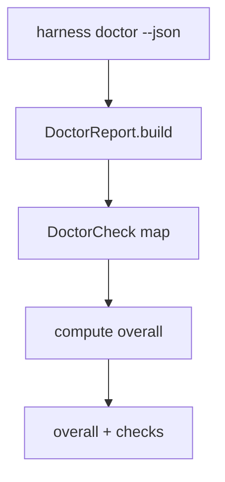

# 073-治理层-Doctor-JSON Output

## 中文版：诊断结果也要能被程序读取

### 全局作用

参见：[000-总览-Harness-分层架构与连载目录](000-总览-Harness-分层架构与连载目录.md)。本文位于治理层的 Doctor 分支。

Doctor JSON Output 让 `harness doctor --json` 输出结构化诊断结果。脚本、CI、server 或后续 UI 可以直接读取每个 check 的 ok、level、message，而不用解析文本。

### 输入 / 输出 / 行为

- 输入：workspace、session、memory、skill、task、run、trace、audit、artifact、sandbox、model config。
- 输出：`overall` 和 `checks` JSON。
- 行为：
  - 每个 check 输出 ok/level/message。
  - warn 不影响 overall。
  - error 会让 overall 为 false。
- 失败模式：路径不可写或 sandbox probe 失败会在 JSON 中体现。

### 实现原理与流程图

DoctorReport 是内部结构，CLI 在 `--json` 模式下序列化为稳定 payload。



### 当前实现

| 项 | 状态 |
|---|---|
| 层 | 治理层 |
| 模块 | Doctor |
| 子模块 | JSON Output |
| 实现状态 | 已实现 |
| 对应提交 | `0a751e5 Add JSON doctor output` |

- CLI：`harness doctor --json`
- 模块：`harness.doctor.DoctorReport`

### 横向对标

| Harness | 对应实现 | 实现原理 |
|---|---|---|
| Claude Code | doctor、analytics | 诊断既给人看，也要能被支持工具读取。 |
| Codex | doctor、state DB checks | 桌面和 CLI 可共享结构化诊断。 |
| OpenClaw | gateway health、diagnostic events | 多节点 health check 必须结构化。 |
| Hermes Agent | doctor、Langfuse plugin | 诊断结果可进入 observability 系统。 |

本仓库用 JSON 输出为后续 server/workbench 预留接口。

### 测试例跑法

```bash
PYTHONPATH=src python3 -m pytest tests/test_regression_doctor.py -q
```

读者验证点：doctor JSON 中包含 overall 和每个 check 的 ok/level/message。

### 后续扩展

- 增加 machine-readable issue code。
- 增加修复建议。
- 支持 doctor report artifact。

## English Version

Doctor JSON output exposes diagnostics as structured data for CI, scripts, and
future server/UI layers.
