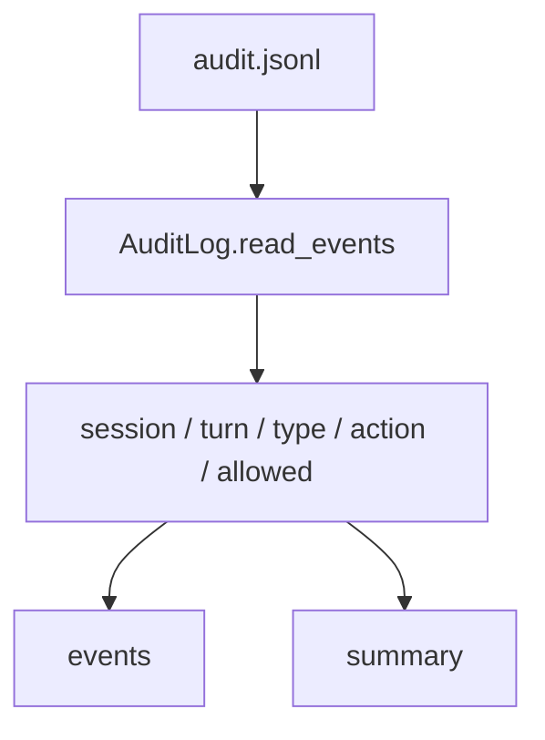

# 074-治理层-Audit-Turn Filters

## 中文版：审计事件可以按 turn 精确过滤

### 全局作用

参见：[000-总览-Harness-分层架构与连载目录](000-总览-Harness-分层架构与连载目录.md)。本文位于治理层的 Audit 分支。

Audit Turn Filters 让审计查询支持 `turn_id`。当一个 session 有多轮运行时，只按 session 看审计会混在一起；turn filter 能定位某一轮的权限拒绝、审批和工具治理事件。

### 输入 / 输出 / 行为

- 输入：audit JSONL、turn id。
- 输出：匹配 turn 的审计事件或 summary。
- 行为：
  - `AuditQuery.events(turn_id=...)` 过滤事件。
  - CLI `harness audit --turn <id>` 支持文本和 JSON。
  - summary 也可以按 turn 统计。
- 失败模式：没有匹配事件时返回空列表或零 summary。

### 实现原理与流程图

turn_id 是 audit event 上的普通字段，过滤时与 session/action/type/allowed 组合使用。



### 当前实现

| 项 | 状态 |
|---|---|
| 层 | 治理层 |
| 模块 | Audit |
| 子模块 | Turn Filters |
| 实现状态 | 已实现 |
| 对应提交 | `c31372f Filter audit events by turn` |

- 模块：`AuditQuery.events`、`AuditQuery.summary`
- CLI：`harness audit --turn <turn-id>`

### 横向对标

| Harness | 对应实现 | 实现原理 |
|---|---|---|
| Claude Code | permission hooks、analytics | 权限事件需要和具体 turn/tool call 对齐。 |
| Codex | approval cache、rollout trace | approval 与 turn/run 绑定，便于复盘。 |
| OpenClaw | exec approval、security audit | 多节点审计必须按会话/轮次过滤。 |
| Hermes Agent | logs、trajectories、approval | trajectory 中的治理事件按 step/turn 定位。 |

本仓库把 turn filter 作为 audit query 的基础维度，为 run diagnose 服务。

### 测试例跑法

```bash
PYTHONPATH=src python3 -m pytest tests/test_artifacts_audit.py::test_audit_query_filters_events tests/test_artifacts_audit.py::test_cli_artifacts_and_audit_smoke -q
```

读者验证点：`--turn t1` 不会返回 `turn_id=t2` 的事件。

### 后续扩展

- 增加 tool_call_id 过滤。
- 增加 actor/resource 过滤。
- 与 trace timeline 合并展示。

## English Version

Audit turn filters isolate governance events for one kernel turn inside a
session.
