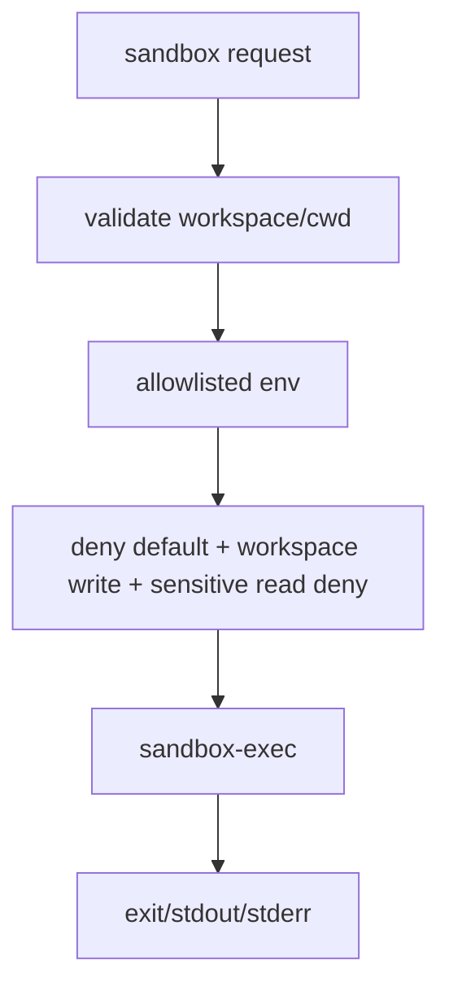

# 075-执行层-Sandbox-Local Runner Hardening

## 中文版：本地沙箱要拒绝敏感读取和越界写入

### 全局作用

参见：[000-总览-Harness-分层架构与连载目录](000-总览-Harness-分层架构与连载目录.md)。本文位于执行与安全基础设施层的 Sandbox 分支。

Local Runner Hardening 加强内置 macOS runner：环境变量 allowlist、workspace 写入限制、cwd 校验、敏感目录读取拒绝。这是 Phase 1 轻量工具级沙箱的核心安全边界。

### 输入 / 输出 / 行为

- 输入：sandbox request。
- 输出：执行结果或拒绝错误。
- 行为：
  - cwd 必须在 workspace 内。
  - 只保留 allowlist 环境变量和显式 env。
  - 允许写 workspace，拒绝写 workspace 外路径。
  - 拒绝读取 `.ssh`、`.aws`、`.kube`、`.hermes` 等敏感目录。
- 失败模式：非 macOS、sandbox-exec 缺失、越权读写、timeout 都失败。

### 实现原理与流程图

runner 生成 macOS sandbox profile：默认 deny，允许进程和必要系统调用，允许读取普通文件但显式 deny 敏感路径，只允许 workspace 写入。



### 当前实现

| 项 | 状态 |
|---|---|
| 层 | 执行与安全基础设施 |
| 模块 | Sandbox |
| 子模块 | Local Runner Hardening |
| 实现状态 | 已实现 |
| 对应提交 | `e0d507a Harden local sandbox runner` |

- 模块：`harness.sandbox_runner`
- 关键函数：`_macos_sandbox_profile`、`_sensitive_read_paths`、`_build_env`

### 横向对标

| Harness | 对应实现 | 实现原理 |
|---|---|---|
| Claude Code | sandbox adapter、secure storage、permission hooks | 沙箱、权限、密钥隔离必须同时存在。 |
| Codex | platform sandbox、network proxy、keyring | 执行环境和密钥访问分离。 |
| OpenClaw | Docker / SSH / OpenShell sandbox、secrets | 强隔离后端负责资源边界。 |
| Hermes Agent | multi-backend sandbox、approval | 不同后端统一执行安全语义。 |

本仓库当前只做 macOS 本地轻量隔离，不声称等价容器级强隔离。

### 测试例跑法

```bash
PYTHONPATH=src python3 -m pytest tests/test_sandbox_runner.py -q
```

读者验证点：runner 拒绝 cwd 逃逸、workspace 外写入、敏感目录读取，并清理环境变量。

### 后续扩展

- 增加 Linux 后端。
- sandbox 结果结构化写入 audit。
- 支持网络开关和资源限制。

## English Version

Local runner hardening keeps execution tools behind a macOS sandbox with
workspace write limits, sensitive read denial, cwd checks, and env allowlisting.
