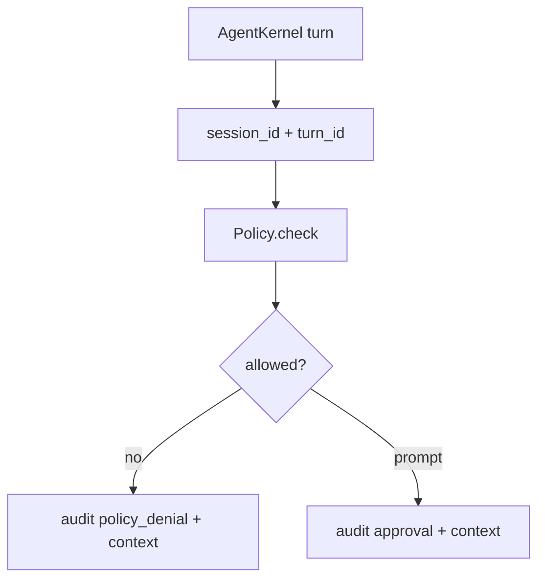

# 076-治理层-Audit-Turn Context

## 中文版：权限审计要带上 session 和 turn

### 全局作用

参见：[000-总览-Harness-分层架构与连载目录](000-总览-Harness-分层架构与连载目录.md)。本文位于治理层的 Audit 分支。

Turn Context 让 policy denial 和 approval audit 事件带上 `session_id` 与 `turn_id`。没有上下文的权限事件只能说明“某工具被拒绝”，不能说明“哪次运行中被拒绝”。

### 输入 / 输出 / 行为

- 输入：Policy.check 的 `audit_context`。
- 输出：包含 session/turn 字段的 audit event。
- 行为：
  - Kernel 调工具时传入 session_id 和 turn_id。
  - Policy denial 写入同样上下文。
  - Prompt approval 写入同样上下文。
- 失败模式：没有 audit 或 context 时仍能做权限判断，只是审计事件缺少上下文。

### 实现原理与流程图

Kernel 负责提供运行上下文，Policy 只负责在审计时原样附带 context。



### 当前实现

| 项 | 状态 |
|---|---|
| 层 | 治理层 |
| 模块 | Audit / Policy |
| 子模块 | Turn Context |
| 实现状态 | 已实现 |
| 对应提交 | `36b22b2 Attach turn context to policy audit` |

- 模块：`Policy.check(audit_context=...)`
- 调用点：`AgentKernel`

### 横向对标

| Harness | 对应实现 | 实现原理 |
|---|---|---|
| Claude Code | permission hooks、query profiler | 权限事件要和具体 query/turn 对齐。 |
| Codex | approval cache、rollout trace | approval 需要绑定 turn/run，避免授权漂移。 |
| OpenClaw | exec approval、security audit | 审计上下文包含 session/node/user。 |
| Hermes Agent | approval、trajectory logs | approval 是 trajectory 的一类事件。 |

本仓库先绑定 session/turn，后续再加入 actor、resource、tool_call_id。

### 测试例跑法

```bash
PYTHONPATH=src python3 -m pytest tests/test_approval.py::test_policy_audit_records_context tests/test_kernel.py::test_kernel_policy_denial_audit_includes_turn_context -q
```

读者验证点：policy denial audit 中包含 session_id 和 turn_id。

### 后续扩展

- 加入 tool_call_id。
- 加入 workspace/resource scope。
- 审批缓存绑定上下文。

## English Version

Audit turn context ties permission decisions to the exact session and turn that
triggered them.
