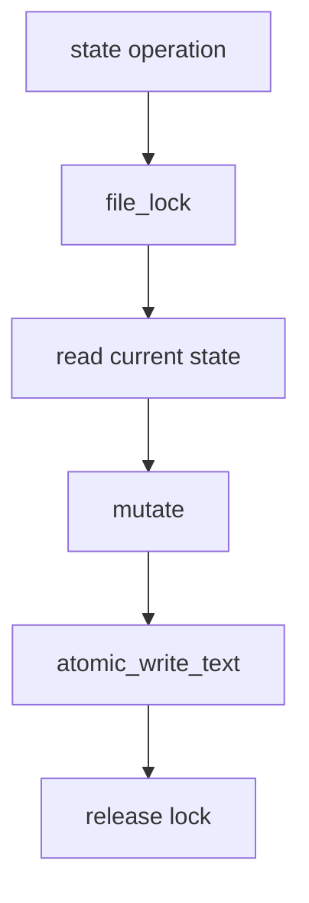

# 077-状态层-Storage-Core State Locks

## 中文版：核心状态文件需要文件锁

### 全局作用

参见：[000-总览-Harness-分层架构与连载目录](000-总览-Harness-分层架构与连载目录.md)。本文位于状态层的 Storage 分支。

Core State Locks 为 session、task、run 等核心状态读写加文件锁，避免多个本地进程同时写状态时互相覆盖或读到半更新内容。

### 输入 / 输出 / 行为

- 输入：core store 的 create/update/load/list/save 操作。
- 输出：串行化后的状态读写。
- 行为：
  - `file_lock` 使用 `fcntl.flock`。
  - 读写 JSON 前先拿锁。
  - 写入仍使用 atomic write。
  - session 每个 session id 使用独立 lock。
- 失败模式：进程崩溃时 OS 释放锁；网络文件系统语义不在当前保证范围。

### 实现原理与流程图

锁保证同一状态文件的临界区串行，atomic write 保证落盘完整；两者一起构成本地状态可靠性基础。



### 当前实现

| 项 | 状态 |
|---|---|
| 层 | 状态层 |
| 模块 | Storage |
| 子模块 | Core State Locks |
| 实现状态 | 已实现 |
| 对应提交 | `c986989 Lock core state stores` |

- 模块：`harness.storage.file_lock`
- 覆盖：`JsonlSessionStore`、`TaskStore`、`RunStore`

### 横向对标

| Harness | 对应实现 | 实现原理 |
|---|---|---|
| Claude Code | session state、memory files | 本地状态要避免并发写损坏。 |
| Codex | state DB | 数据库事务承担锁和一致性。 |
| OpenClaw | control plane state | 多节点通常交给服务端一致性机制。 |
| Hermes Agent | state.db | SQLite 提供文件级事务。 |

本仓库用文件锁保持本地文件存储简单可靠。

### 测试例跑法

```bash
PYTHONPATH=src python3 -m pytest tests/test_runs.py::test_run_store_serializes_concurrent_creates tests/test_session_context.py::test_jsonl_session_store_appends_snapshots_and_loads_latest tests/test_tasks.py -q
```

读者验证点：并发创建 run 不丢记录；session/task 读写稳定。

### 后续扩展

- 增加跨平台锁实现。
- 将高并发状态迁移 SQLite。
- 增加锁超时和诊断。

## English Version

Core state locks serialize local session, task, and run state updates while
atomic writes keep files complete.
