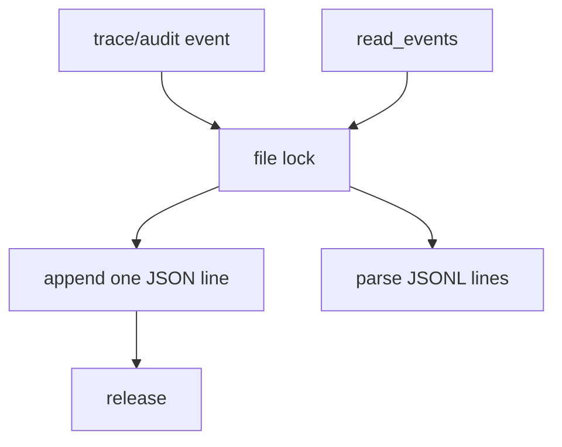

# 078-可观测层-Storage-Trace And Audit Locks

## 中文版：Trace 和 Audit 追加写也要串行

### 全局作用

参见：[000-总览-Harness-分层架构与连载目录](000-总览-Harness-分层架构与连载目录.md)。本文位于可观测层和治理层的 Storage 分支。

Trace And Audit Locks 为 trace/audit JSONL 追加写和读取加锁，防止多进程并发写入时 JSON 行交错，保证诊断和审计证据可解析。

### 输入 / 输出 / 行为

- 输入：TraceRecorder.record、AuditLog.record、read_events。
- 输出：完整 JSONL 行。
- 行为：
  - 追加写通过 `locked_append_text`。
  - 读取时拿同名 lock。
  - 空文件或不存在文件返回空事件列表。
- 失败模式：单行 JSON 损坏会解析失败，暴露日志写入问题。

### 实现原理与流程图

JSONL 的基本单位是一行事件。锁保证每次 append 写入一整行，不与其他进程交错。



### 当前实现

| 项 | 状态 |
|---|---|
| 层 | 可观测层 / 治理层 |
| 模块 | Trace / Audit |
| 子模块 | Locks |
| 实现状态 | 已实现 |
| 对应提交 | `76c80f9 Lock trace and audit logs` |

- 模块：`TraceRecorder`、`AuditLog`
- 存储工具：`locked_append_text`、`file_lock`

### 横向对标

| Harness | 对应实现 | 实现原理 |
|---|---|---|
| Claude Code | analytics、VCR fixtures | 事件日志必须保持可回放。 |
| Codex | rollout trace、OTel | 轨迹事件需要完整、可归约。 |
| OpenClaw | gateway logs、diagnostic events | 多节点日志需要更强聚合和顺序策略。 |
| Hermes Agent | logs、trajectories、Langfuse | 轨迹日志要可批量处理。 |

本仓库用本地文件锁保证最小可靠性，后续可接 OTel/exporter。

### 测试例跑法

```bash
PYTHONPATH=src python3 -m pytest tests/test_trace_cli.py::test_trace_recorder_serializes_concurrent_events tests/test_artifacts_audit.py::test_audit_log_serializes_concurrent_events -q
```

读者验证点：并发写 trace/audit 后 JSONL 行数完整且可解析。

### 后续扩展

- 增加事件序号。
- 增加日志轮转。
- 接入外部 observability。

## English Version

Trace and audit locks keep append-only JSONL event logs parseable under local
concurrent writes.
