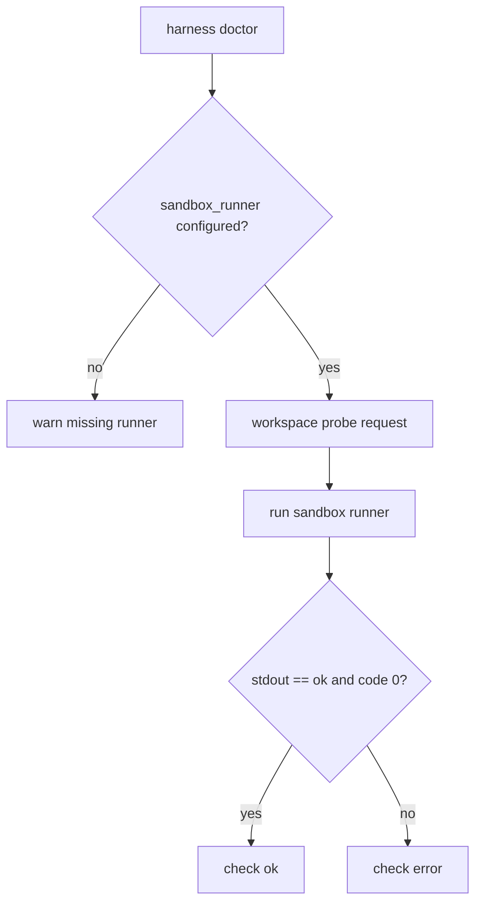

# 079-治理层-Doctor-Sandbox Probe

## 中文版：Doctor 要实际探测 sandbox runner

### 全局作用

参见：[000-总览-Harness-分层架构与连载目录](000-总览-Harness-分层架构与连载目录.md)。本文位于治理层的 Doctor 分支。

Sandbox Probe 让 doctor 不只检查 `sandbox_runner` 配置是否存在，还会实际运行一个 workspace 内写入和读取探针，确认高风险工具的执行边界可用。

### 输入 / 输出 / 行为

- 输入：sandbox_runner、workspace。
- 输出：doctor check `sandbox_runner`。
- 行为：
  - runner 缺失返回 warn。
  - 创建 workspace probe request。
  - runner 执行 `printf ok > probe && cat probe`。
  - stdout 必须等于 `ok` 才通过。
- 失败模式：runner 不存在、超时、返回非零、输出不符合预期都为 error。

### 实现原理与流程图

配置存在不代表可用。doctor 通过真实 sandbox request 证明执行工具能走 runner。



### 当前实现

| 项 | 状态 |
|---|---|
| 层 | 治理层 |
| 模块 | Doctor |
| 子模块 | Sandbox Probe |
| 实现状态 | 已实现 |
| 对应提交 | `ed99dc0 Probe sandbox in doctor` |

- 模块：`harness.doctor._check_sandbox_runner`
- CLI：`harness doctor --sandbox-runner ...`

### 横向对标

| Harness | 对应实现 | 实现原理 |
|---|---|---|
| Claude Code | doctor、sandbox adapter | doctor 需要证明执行环境可用。 |
| Codex | doctor、platform sandbox | sandbox check 是本地运行前置诊断。 |
| OpenClaw | gateway health、exec sandbox | 多节点执行要探测 runner。 |
| Hermes Agent | doctor、sandbox backends | 多后端 sandbox 都需要 health probe。 |

本仓库将 sandbox probe 放进 doctor，是 fail closed 策略的可见化。

### 测试例跑法

```bash
PYTHONPATH=src python3 -m pytest tests/test_regression_doctor.py::test_cli_doctor_probes_configured_sandbox_runner -q
```

读者验证点：配置内置 runner 后，doctor JSON 显示 sandbox_runner ok。

### 后续扩展

- 探测读敏感路径是否拒绝。
- 探测网络策略。
- 输出 sandbox backend 类型。

## English Version

Doctor sandbox probe verifies that the configured runner can actually execute a
workspace-scoped command.
