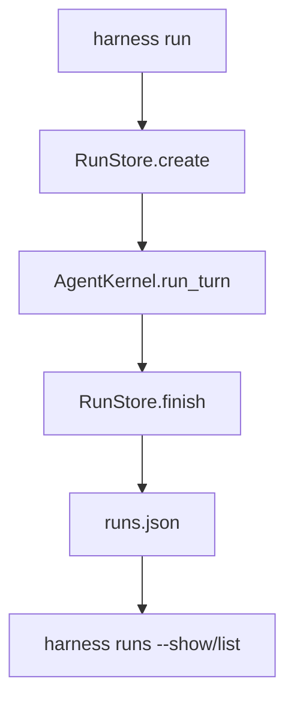

# 080-运行时层-Runs-Local Run Ledger

## 中文版：每次运行都要有账本记录

### 全局作用

参见：[000-总览-Harness-分层架构与连载目录](000-总览-Harness-分层架构与连载目录.md)。本文位于 Harness Runtime 的 Run Ledger 分支。

Local Run Ledger 记录每次 run 的 id、prompt、workspace、status、session_id、turn_id、stop_reason、iterations 和时间。它把一次 CLI 调用变成可查询、可诊断、可排队的运行对象。

### 输入 / 输出 / 行为

- 输入：run 创建、完成、列表、展示请求。
- 输出：run record。
- 行为：
  - `create()` 创建 in_progress record。
  - `finish()` 写入最终状态和 turn 信息。
  - CLI `harness runs` 支持 list/show/json。
  - 支持按 status/session 过滤和 limit。
- 失败模式：run id 不存在时报错；非法 status 报错。

### 实现原理与流程图

RunStore 是本地 JSON 状态文件，带文件锁和原子写。CLI run 会先 create，turn 完成后 finish。



### 当前实现

| 项 | 状态 |
|---|---|
| 层 | Harness Runtime |
| 模块 | Runs |
| 子模块 | Local Run Ledger |
| 实现状态 | 已实现 |
| 对应提交 | `bb9e720 Add local run ledger` |

- 模块：`harness.runs.RunStore`
- CLI：`harness runs --show/--status/--session/--limit/--json`

### 横向对标

| Harness | 对应实现 | 实现原理 |
|---|---|---|
| Claude Code | task registry、analytics | run 级记录服务成本和失败复盘。 |
| Codex | run records、state DB、rollout trace | run ledger 与 rollout trace 共同定位一次执行。 |
| OpenClaw | session routing、cron、diagnostic events | 控制面需要运行记录追踪任务状态。 |
| Hermes Agent | batch runner、state.db、trajectories | 批量执行依赖 run ledger。 |

本仓库先用本地 JSON ledger，后续 server 化时可迁移数据库。

### 测试例跑法

```bash
PYTHONPATH=src python3 -m pytest tests/test_runs.py::test_run_store_creates_finishes_lists_and_filters tests/test_cli_smoke.py::test_cli_run_records_run_ledger -q
```

读者验证点：run 完成后 runs ledger 中有 session_id、turn_id、stop_reason。

### 后续扩展

- 增加 run attempt。
- 增加 parent/child run。
- 与 task、artifact、trace 建立索引。

## English Version

The local run ledger turns each CLI execution into a durable record that can be
listed, inspected, diagnosed, and queued.
