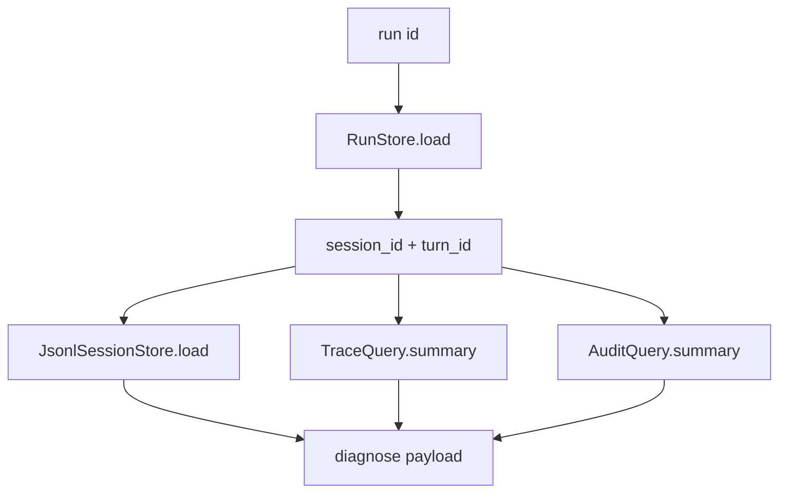

# 081-运行时层-Runs-Diagnostics

## 中文版：一次运行失败后要能汇总诊断

### 全局作用

参见：[000-总览-Harness-分层架构与连载目录](000-总览-Harness-分层架构与连载目录.md)。本文位于 Harness Runtime 和可观测层交界处。

Run Diagnostics 通过 `harness runs --diagnose <run-id>` 汇总 run record、session summary、trace summary、audit summary。它让失败排查从“翻多个文件”变成“围绕一次 run 查看事实”。

### 输入 / 输出 / 行为

- 输入：run id、run_dir、session_dir、trace、audit。
- 输出：诊断文本或 JSON。
- 行为：
  - 加载 run record。
  - 按 session_id 加载 session summary。
  - 按 session_id + turn_id 查询 trace summary。
  - 按 session_id + turn_id 查询 audit summary。
- 失败模式：run 不存在时报错；缺少 session 时 session 字段为 null。

### 实现原理与流程图

run ledger 是诊断入口，trace/audit/session 是证据来源。diagnose 不复制数据，只做按 id 聚合。



### 当前实现

| 项 | 状态 |
|---|---|
| 层 | Harness Runtime / 可观测层 |
| 模块 | Runs |
| 子模块 | Diagnostics |
| 实现状态 | 已实现 |
| 对应提交 | `cff45b0 Add run diagnostics` |

- CLI：`harness runs --diagnose <run-id> --json`
- 依赖：RunStore、SessionStore、TraceQuery、AuditQuery。

### 横向对标

| Harness | 对应实现 | 实现原理 |
|---|---|---|
| Claude Code | doctor、query profiler、analytics | 运行诊断围绕会话、工具、成本和错误聚合。 |
| Codex | rollout trace、state DB、doctor | run 诊断从 state DB 和 trace 中取事实。 |
| OpenClaw | diagnostic events、gateway logs | 多节点 run 需要汇总 gateway 和 runner 事件。 |
| Hermes Agent | trajectories、batch runner、doctor | trajectory 是 run diagnosis 的核心证据。 |

本仓库先围绕本地 run id 做诊断，后续可加入 artifact 和 checkpoint。

### 测试例跑法

```bash
PYTHONPATH=src python3 -m pytest tests/test_cli_smoke.py::test_cli_runs_diagnose_summarizes_failed_run -q
```

读者验证点：诊断 JSON 包含 run、session、trace_summary、audit_summary。

### 后续扩展

- 加入 checkpoint diff。
- 加入相关 artifacts。
- 生成 markdown diagnosis report。

## English Version

Run diagnostics aggregate run, session, trace, and audit facts around one run
id.
