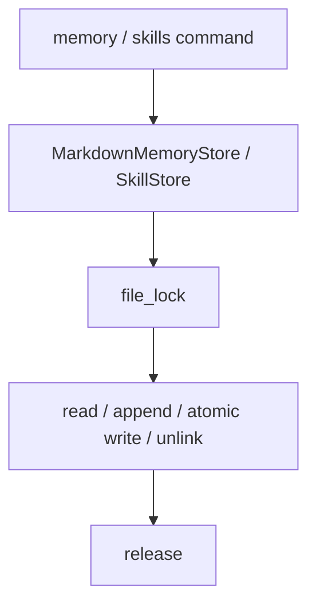

# 082-状态层-Storage-Memory And Skill Locks

## 中文版：Memory 和 Skill 文件也要并发安全

### 全局作用

参见：[000-总览-Harness-分层架构与连载目录](000-总览-Harness-分层架构与连载目录.md)。本文位于状态层的 Memory / Skill Storage 分支。

Memory And Skill Locks 为 Markdown memory 和 skill 文件读写加锁。memory/skill 是 runtime 上下文来源，如果并发维护时损坏，会直接影响模型行为。

### 输入 / 输出 / 行为

- 输入：memory add/list/clear/search/render，skill add/list/get/delete/search/render。
- 输出：稳定的文件状态。
- 行为：
  - memory 使用 `memory.lock`。
  - skill 使用 `skills.lock`。
  - 写入使用 atomic write 或 locked append。
  - 读取时拿锁。
- 失败模式：文件权限错误会抛出；并发写入应串行。

### 实现原理与流程图

memory 是单文件追加，skill 是多文件目录；两者都用同一套 `file_lock` 把读写临界区串起来。



### 当前实现

| 项 | 状态 |
|---|---|
| 层 | 状态层 |
| 模块 | Memory / Skills |
| 子模块 | Locks |
| 实现状态 | 已实现 |
| 对应提交 | `ef036b5 Lock memory and skill stores` |

- 模块：`MarkdownMemoryStore`、`SkillStore`
- 锁文件：`memory.lock`、`skills.lock`

### 横向对标

| Harness | 对应实现 | 实现原理 |
|---|---|---|
| Claude Code | CLAUDE.md、auto memory、skills/plugins | 上下文文件需要稳定读写。 |
| Codex | AGENTS.md、memories、skill loader | 本地记忆和 skill loader 需要并发安全。 |
| OpenClaw | Markdown memory、skills gating | plugin slot 读写需要一致性。 |
| Hermes Agent | skills hub、memory providers、state.db | 生产环境可转入 DB 或服务化存储。 |

本仓库先用文件锁保持 Markdown 透明性，后续再做索引和版本。

### 测试例跑法

```bash
PYTHONPATH=src python3 -m pytest tests/test_memory.py tests/test_skills.py -q
```

读者验证点：memory/skill 增删查改稳定，写入结果可读。

### 后续扩展

- 增加并发 memory/skill 测试。
- 记录 source/version。
- skill registry 支持运行时加载策略。

## English Version

Memory and skill locks protect local context files from concurrent corruption.
