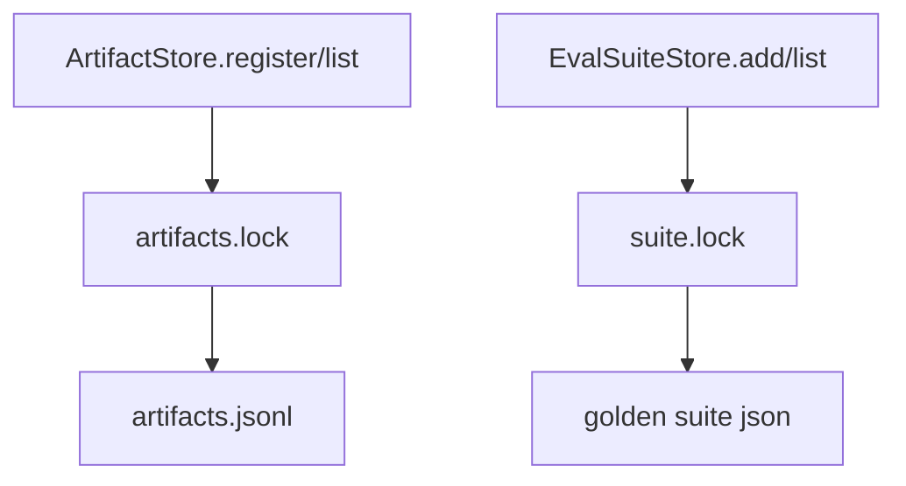

# 083-产物层-Storage-Artifact And Eval Locks

## 中文版：产物索引和评测套件也要锁住

### 全局作用

参见：[000-总览-Harness-分层架构与连载目录](000-总览-Harness-分层架构与连载目录.md)。本文位于产物层和评测层的 Storage 分支。

Artifact And Eval Locks 为 artifact index 和 eval suite 文件加锁，避免多进程同时登记产物或添加 golden case 时丢记录。

### 输入 / 输出 / 行为

- 输入：artifact register/list、eval suite add/list。
- 输出：一致的 artifact JSONL 和 suite JSON。
- 行为：
  - artifact 追加用 `locked_append_text`，读取用 artifacts.lock。
  - eval suite add/list/run 使用 suite lock。
  - eval suite 写入使用 atomic write。
- 失败模式：文件权限或 JSON 损坏会失败；并发追加不应交错。

### 实现原理与流程图

artifact 是 append-only JSONL，eval suite 是 JSON object；两种形态都通过 lock 保证读写顺序。



### 当前实现

| 项 | 状态 |
|---|---|
| 层 | 产物层 / 评测层 |
| 模块 | Artifacts / EvalSuite |
| 子模块 | Locks |
| 实现状态 | 已实现 |
| 对应提交 | `bfd6ef3 Lock artifact and eval stores` |

- 模块：`ArtifactStore`、`EvalSuiteStore`
- 锁：`artifacts.lock`、`<suite>.lock`

### 横向对标

| Harness | 对应实现 | 实现原理 |
|---|---|---|
| Claude Code | VCR fixtures、analytics artifacts | fixture 和诊断产物要避免并发破坏。 |
| Codex | rollout trace、tests | eval 数据通常进入受控存储。 |
| OpenClaw | diagnostic artifacts、gateway logs | 多节点产物需要服务端一致性。 |
| Hermes Agent | trajectories、batch runner | batch 产物和 eval suite 需要并发安全。 |

本仓库用本地锁满足单机并发，后续可迁移 DB。

### 测试例跑法

```bash
PYTHONPATH=src python3 -m pytest tests/test_artifacts_audit.py tests/test_regression_doctor.py::test_eval_suite_store_adds_and_lists_cases -q
```

读者验证点：artifact 和 eval case 能稳定登记、读取和验证。

### 后续扩展

- 增加并发 eval suite add 测试。
- artifact source/version 索引。
- eval suite schema version。

## English Version

Artifact and eval locks protect local artifact indexes and golden suites from
concurrent update loss.
