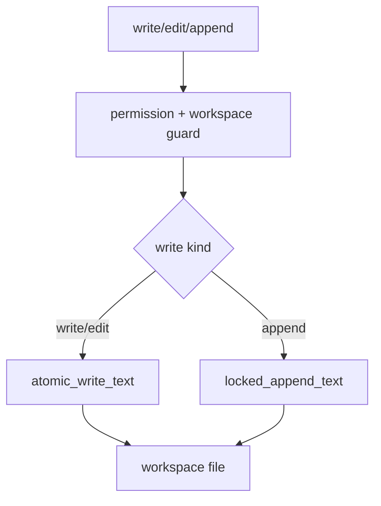

# 084-工具层-Filesystem-Harden Text Writes

## 中文版：文本写入工具要更稳

### 全局作用

参见：[000-总览-Harness-分层架构与连载目录](000-总览-Harness-分层架构与连载目录.md)。本文位于工具层的 Filesystem Write 分支。

Harden Text Writes 让 `write_file` 和 `edit_file` 使用 atomic write，让 `append_file` 使用 locked append。文件写入工具是模型最常用、也最容易破坏 workspace 的能力，写入稳定性必须先保证。

### 输入 / 输出 / 行为

- 输入：write/edit/append 工具调用。
- 输出：文件内容变更。
- 行为：
  - write/edit 使用 `atomic_write_text`。
  - append 使用 `locked_append_text`。
  - 自动创建父目录。
  - 仍受 path guard 和 permission 控制。
- 失败模式：权限不足、路径逃逸、old text 缺失、文件权限错误都会失败。

### 实现原理与流程图

写入工具分成覆盖写、替换写、追加写；每种写入都走 storage helper，避免半写和并发追加互相覆盖。



### 当前实现

| 项 | 状态 |
|---|---|
| 层 | 工具层 |
| 模块 | Filesystem |
| 子模块 | Harden Text Writes |
| 实现状态 | 已实现 |
| 对应提交 | `c61c52f Harden text file write tools` |

- 工具：`write_file`、`edit_file`、`append_file`
- 存储 helper：`atomic_write_text`、`locked_append_text`

### 横向对标

| Harness | 对应实现 | 实现原理 |
|---|---|---|
| Claude Code | file edit、permission hooks | 文件编辑工具必须可预览、可回滚、可审计。 |
| Codex | file tools、approval cache | 写入稳定性支撑 approval 和 trace。 |
| OpenClaw | filesystem bridge | 远端写入更需要事务语义。 |
| Hermes Agent | checkpoint、trajectory | 写入和 checkpoint/trajectory 结合形成恢复链。 |

本仓库先强化本地文本写入，后续再做 patch/apply 和变更事件。

### 测试例跑法

```bash
PYTHONPATH=src python3 -m pytest tests/test_tools_workspace.py::test_filesystem_tools_stay_inside_workspace tests/test_tools_workspace.py::test_append_file_serializes_concurrent_appends tests/test_storage.py -q
```

读者验证点：文件写入不逃逸 workspace，追加并发不丢行，atomic write 清理临时文件。

### 后续扩展

- 写入前自动 diff。
- 写入后 artifact/hash 记录。
- 支持编辑事务。

## English Version

Text write hardening routes write/edit through atomic writes and append through
locked appends.
