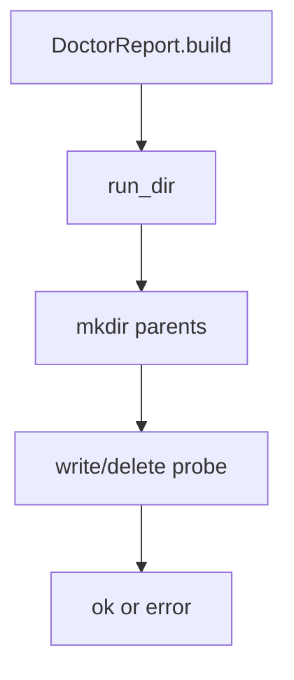

# 085-治理层-Doctor-Run Directory Check

## 中文版：Doctor 要检查 run ledger 目录

### 全局作用

参见：[000-总览-Harness-分层架构与连载目录](000-总览-Harness-分层架构与连载目录.md)。本文位于治理层的 Doctor 分支。

Run Directory Check 将 `run_dir` 纳入 doctor。引入 run ledger 和 queue 后，运行状态目录和 session/task 一样关键；不可写会导致 run 无法记录、排队、诊断。

### 输入 / 输出 / 行为

- 输入：run_dir path。
- 输出：doctor check `run_dir`。
- 行为：
  - 创建目录。
  - 写入并删除 probe 文件。
  - 输出 writable 或 error。
- 失败模式：路径权限不足、父目录不可写会返回 error。

### 实现原理与流程图

doctor 对 run_dir 使用和 session/task/artifact 相同的 path writable check。



### 当前实现

| 项 | 状态 |
|---|---|
| 层 | 治理层 |
| 模块 | Doctor |
| 子模块 | Run Directory Check |
| 实现状态 | 已实现 |
| 对应提交 | `bdaea0e Check run directory in doctor` |

- 模块：`DoctorReport.build`
- CLI：`harness doctor --run-dir ...`

### 横向对标

| Harness | 对应实现 | 实现原理 |
|---|---|---|
| Claude Code | doctor、task registry | 运行/任务状态目录需要诊断。 |
| Codex | state DB、doctor | 状态库健康是启动前检查。 |
| OpenClaw | control plane state | run/task 状态属于控制面依赖。 |
| Hermes Agent | state.db、batch runner | batch/run 目录或 DB 是核心依赖。 |

本仓库将 run_dir 纳入 doctor，保证 queue/ledger 模块可用性可见。

### 测试例跑法

```bash
PYTHONPATH=src python3 -m pytest tests/test_regression_doctor.py -q
```

读者验证点：doctor 输出包含 `run_dir: ok`，JSON 中也有 run_dir check。

### 后续扩展

- 检查 runs.json 是否可解析。
- 检查 queue 是否有卡住的 in_progress。
- 输出修复建议。

## English Version

Run directory check makes the run ledger and queue storage part of doctor
diagnostics.
