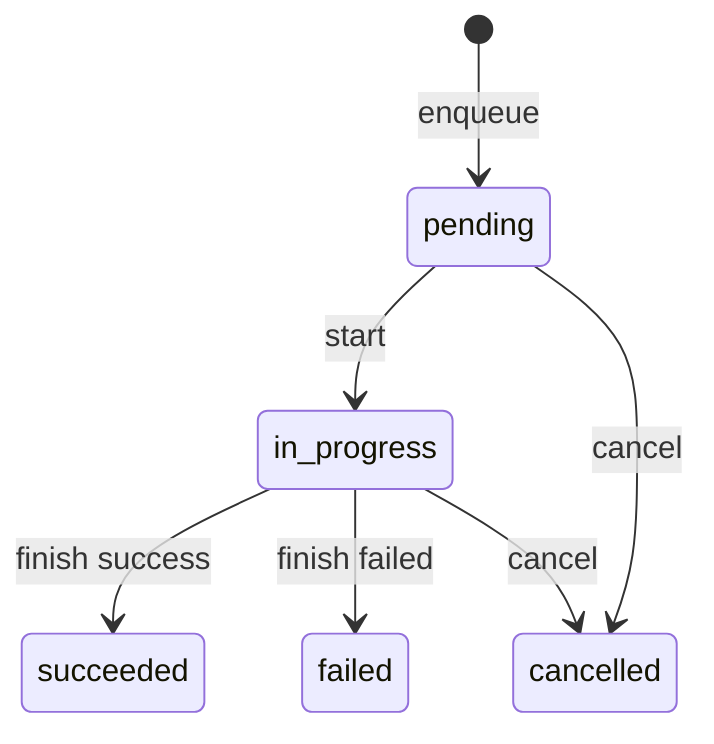

# 086-运行时层-RunQueue-Queued Run States

## 中文版：Run 可以先入队，再执行

### 全局作用

参见：[000-总览-Harness-分层架构与连载目录](000-总览-Harness-分层架构与连载目录.md)。本文位于 Harness Runtime 的 Run Queue 分支。

Queued Run States 为 RunStore 增加 `pending`、`in_progress`、`succeeded`、`failed`、`cancelled` 状态，以及 enqueue/start/cancel。它把 run ledger 扩展成最小本地队列。

### 输入 / 输出 / 行为

- 输入：prompt、workspace、可选 session_id/task_id。
- 输出：pending run record。
- 行为：
  - `enqueue()` 创建 pending record。
  - `start()` 只允许 pending -> in_progress。
  - `cancel()` 允许 pending/in_progress -> cancelled。
  - list 可按 status 过滤。
- 失败模式：取消已完成 run 会失败；start 非 pending run 会失败。

### 实现原理与流程图

队列状态仍存在 runs.json 中，避免单独引入 broker。pending records 按 started_at/id 排序。



### 当前实现

| 项 | 状态 |
|---|---|
| 层 | Harness Runtime |
| 模块 | RunQueue |
| 子模块 | Queued Run States |
| 实现状态 | 已实现 |
| 对应提交 | `7bcbd08 Add queued run states` |

- 模块：`RunStore.enqueue`、`start`、`cancel`
- CLI：`harness runs --enqueue`、`--cancel`

### 横向对标

| Harness | 对应实现 | 实现原理 |
|---|---|---|
| Claude Code | task registry、subagent/forked agent | 长程任务需要可排队和分派。 |
| Codex | run records、agent roles、hooks | 本地 run queue 可演进为 worker。 |
| OpenClaw | cron、ACP control plane | 队列是控制面调度基础。 |
| Hermes Agent | kanban workers、batch runner | worker/批处理依赖 run 状态机。 |

本仓库先用本地 pending 状态形成最小队列。

### 测试例跑法

```bash
PYTHONPATH=src python3 -m pytest tests/test_runs.py::test_run_store_enqueues_starts_and_cancels_runs tests/test_cli_smoke.py::test_cli_runs_can_enqueue_and_cancel -q
```

读者验证点：run 可 enqueue、start、cancel，并按状态过滤。

### 后续扩展

- 增加 priority。
- 支持 retry attempt。
- 支持后台 worker。

## English Version

Queued run states extend the local run ledger into a minimal pending/in-progress
run queue.
