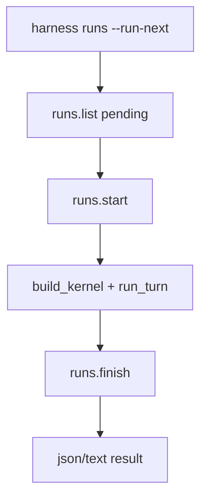

# 087-运行时层-RunQueue-Run Next Local

## 中文版：本地 worker 可以执行下一条 pending run

### 全局作用

参见：[000-总览-Harness-分层架构与连载目录](000-总览-Harness-分层架构与连载目录.md)。本文位于 Harness Runtime 的 Run Queue 分支。

Run Next Local 提供 `harness runs --run-next`，从 pending queue 取下一条 run，在本地直接执行，并把结果写回 run ledger。它是本地 worker 的最小形态。

### 输入 / 输出 / 行为

- 输入：pending run record、当前 config。
- 输出：执行结果和更新后的 run record。
- 行为：
  - 选择第一条 pending run。
  - start 后构建 kernel。
  - 执行 prompt。
  - 根据 stop reason 标记 succeeded/failed。
  - JSON 输出 run_id、session_id、turn_id、stop_reason。
- 失败模式：没有 pending run 时报错；执行异常由 worker failure 逻辑兜底。

### 实现原理与流程图

queued run 保存 prompt/workspace/session/task，worker 把这些字段重新写回 args，再复用普通 Kernel run。



### 当前实现

| 项 | 状态 |
|---|---|
| 层 | Harness Runtime |
| 模块 | RunQueue |
| 子模块 | Run Next Local |
| 实现状态 | 已实现 |
| 对应提交 | `913d117 Run next queued record locally` |

- CLI：`harness runs --run-next`
- Worker helper：`_run_queued_record`

### 横向对标

| Harness | 对应实现 | 实现原理 |
|---|---|---|
| Claude Code | subagent/forked agent、task registry | 子 agent 执行可以看作运行队列的一种形态。 |
| Codex | agent roles、hooks、run records | 本地 worker 复用 run ledger 和 hooks。 |
| OpenClaw | cron、ACP control plane | 控制面调度 pending 任务到 runner。 |
| Hermes Agent | kanban workers、batch runner | worker 从队列取任务并回写状态。 |

本仓库先实现单进程 run-next，为后续后台 worker/server 做准备。

### 测试例跑法

```bash
PYTHONPATH=src python3 -m pytest tests/test_cli_smoke.py::test_cli_runs_can_run_next_pending_record -q
```

读者验证点：pending run 被执行，ledger 中状态变为 succeeded 并写入 turn_id。

### 后续扩展

- 多 worker 并发领取。
- lease/heartbeat 防止卡住。
- 失败重试策略。

## English Version

Run-next executes the next pending local run record and writes the result back
to the run ledger.
