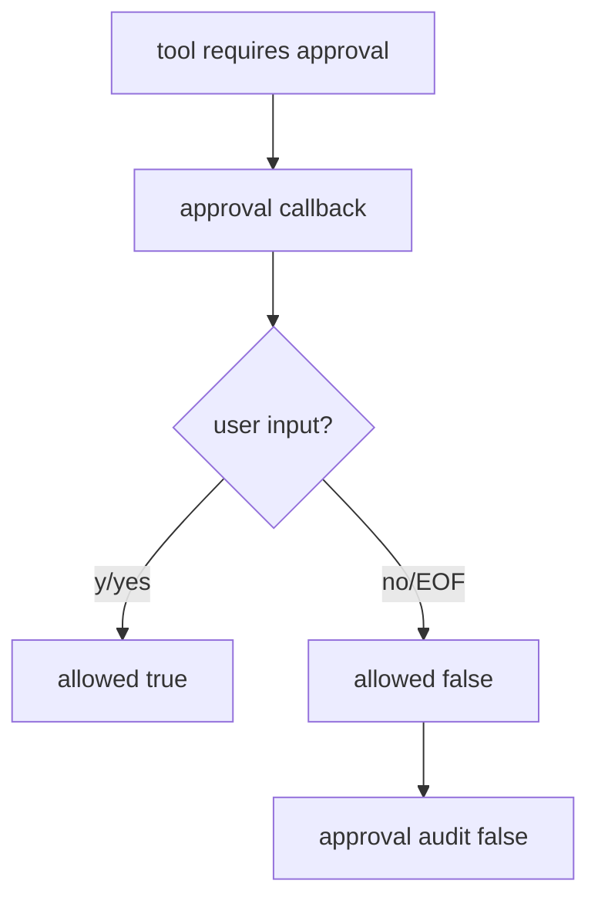

# 088-治理层-Approval-Fail Closed Missing Input

## 中文版：需要审批但没有输入时默认拒绝

### 全局作用

参见：[000-总览-Harness-分层架构与连载目录](000-总览-Harness-分层架构与连载目录.md)。本文位于治理层的 Approval 分支。

Fail Closed Missing Input 规定 prompt 模式下如果 CLI 等不到用户输入，例如 stdin EOF，审批结果默认拒绝。安全相关交互不能因为无人响应而放行。

### 输入 / 输出 / 行为

- 输入：需要 prompt approval 的工具调用。
- 输出：approval false。
- 行为：
  - CLI 输出审批提示到 stderr。
  - 正常输入 y/yes 才允许。
  - EOFError 返回 False。
  - audit 记录 approval allowed=false。
- 失败模式：无输入时工具被拒绝，turn 继续或按运行策略结束。

### 实现原理与流程图

审批 callback 是 Policy 的依赖，CLI 实现 `_approval_callback`。EOF 被视为拒绝。



### 当前实现

| 项 | 状态 |
|---|---|
| 层 | 治理层 |
| 模块 | Approval |
| 子模块 | Fail Closed Missing Input |
| 实现状态 | 已实现 |
| 对应提交 | `c1767d6 Fail closed on missing approval input` |

- 函数：`harness.cli._approval_callback`
- 配置：`permission=prompt`

### 横向对标

| Harness | 对应实现 | 实现原理 |
|---|---|---|
| Claude Code | permission modes、permission hooks | 审批缺失必须按拒绝处理。 |
| Codex | approval cache、permission profile | 无用户确认不应升级权限。 |
| OpenClaw | exec approval、auth profiles | 远端执行审批超时应拒绝。 |
| Hermes Agent | approval、sandbox | approval 是高风险工具前置条件。 |

本仓库按 fail closed 处理 EOF，与工具级安全策略一致。

### 测试例跑法

```bash
PYTHONPATH=src python3 -m pytest tests/test_cli_smoke.py::test_cli_prompt_permission_denies_without_stdin -q
```

读者验证点：stdin 为空时 write_file 不会执行，audit 记录 approval false。

### 后续扩展

- 支持审批超时。
- 支持审批 reason。
- 审批结果绑定 tool_call_id。

## English Version

Missing approval input fails closed: EOF in prompt mode denies the action and
records a negative approval audit event.
