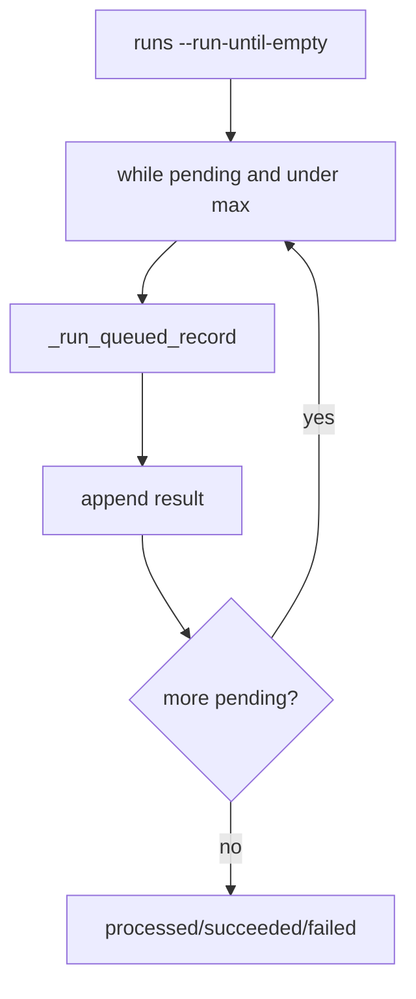

# 089-运行时层-RunQueue-Drain Pending Runs

## 中文版：本地队列可以一次跑到空

### 全局作用

参见：[000-总览-Harness-分层架构与连载目录](000-总览-Harness-分层架构与连载目录.md)。本文位于 Harness Runtime 的 Run Queue 分支。

Drain Pending Runs 提供 `harness runs --run-until-empty`，循环执行 pending records，直到队列为空或达到 `--max-runs`。它让本地 harness 具备最小批处理能力。

### 输入 / 输出 / 行为

- 输入：run queue、max-runs。
- 输出：processed/succeeded/failed 和每条 run 结果。
- 行为：
  - 循环查 pending。
  - 每次调用 `_run_queued_record`。
  - 统计 succeeded/failed。
  - 有 failed 时退出码为 2。
  - 空队列成功返回 processed=0。
- 失败模式：max-runs < 0 报错；单条 run 失败不阻止统计输出。

### 实现原理与流程图

drain 是 run-next 的循环包装，仍然是单进程本地 worker。



### 当前实现

| 项 | 状态 |
|---|---|
| 层 | Harness Runtime |
| 模块 | RunQueue |
| 子模块 | Drain Pending Runs |
| 实现状态 | 已实现 |
| 对应提交 | `4f1f0c7 Drain queued runs locally` |

- CLI：`harness runs --run-until-empty --max-runs --json`

### 横向对标

| Harness | 对应实现 | 实现原理 |
|---|---|---|
| Claude Code | task registry、subagent orchestration | 多任务执行最终需要批处理/编排。 |
| Codex | rollout/batch execution | 批量运行用于 eval 和回归。 |
| OpenClaw | cron、ACP control plane | 控制面定时 drain pending tasks。 |
| Hermes Agent | batch runner、kanban workers | batch runner 是 Hermes 的重要执行形态。 |

本仓库先实现本地 drain，后续再加并发、lease 和 server queue。

### 测试例跑法

```bash
PYTHONPATH=src python3 -m pytest tests/test_cli_smoke.py::test_cli_runs_can_drain_pending_records tests/test_cli_smoke.py::test_cli_runs_drain_empty_queue_is_success tests/test_cli_smoke.py::test_cli_runs_drain_respects_max_runs -q
```

读者验证点：多个 pending run 被依次执行，max-runs 能限制处理数量。

### 后续扩展

- 并发 worker。
- retry/backoff。
- 队列监控和卡住任务恢复。

## English Version

Drain pending runs loops over local pending run records and executes them until
empty or a max-run limit is reached.
