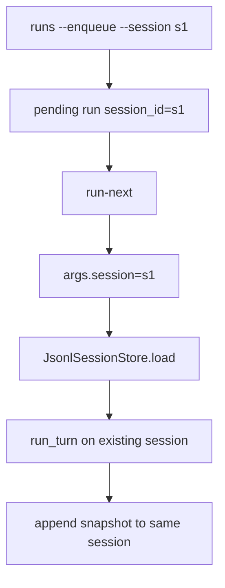

# 090-运行时层-RunQueue-Resume Sessions

## 中文版：排队任务可以接着已有会话跑

### 全局作用

参见：[000-总览-Harness-分层架构与连载目录](000-总览-Harness-分层架构与连载目录.md)。本文位于 Harness Runtime 的 Run Queue 和状态层 Session 交界处。

Resume Sessions 让 queued run 可以携带 existing session_id。worker 执行时会加载这个 session，继续原有上下文，而不是每条队列任务都新开窗口。

### 输入 / 输出 / 行为

- 输入：`harness runs --enqueue ... --session <session-id>`。
- 输出：执行后更新同一 session 的新 snapshot。
- 行为：
  - enqueue 保存 session_id。
  - run-next/run-until-empty 准备 args.session。
  - build_kernel 加载已有 session。
  - turn 完成后保存到同一 session JSONL。
- 失败模式：session_id 不存在时会创建新 session 或按当前 build 逻辑处理；未来应更严格校验。

### 实现原理与流程图

queued record 是 worker 和 session store 之间的桥梁，session_id 让队列任务继承上下文。



### 当前实现

| 项 | 状态 |
|---|---|
| 层 | Harness Runtime / 状态层 |
| 模块 | RunQueue / Session |
| 子模块 | Resume Sessions |
| 实现状态 | 已实现 |
| 对应提交 | `bc9536f Resume sessions from queued runs` |

- CLI：`harness runs --enqueue ... --session <id>`、`--run-next`
- 函数：`_prepare_worker_run_args`、`build_kernel`

### 横向对标

| Harness | 对应实现 | 实现原理 |
|---|---|---|
| Claude Code | remote/direct sessions、handoff、context compact | 长程任务通过 session 续接上下文。 |
| Codex | history manager、state DB、run records | queued run 可以绑定已有历史。 |
| OpenClaw | session routing、subagent session protocol | session id 是通道路由和上下文恢复关键。 |
| Hermes Agent | state.db、conversation loop、kanban workers | worker 需要恢复 conversation state 后继续任务。 |

本仓库先支持 session_id 透传，为本地长程队列打基础。

### 测试例跑法

```bash
PYTHONPATH=src python3 -m pytest tests/test_cli_smoke.py::test_cli_queued_run_can_resume_existing_session -q
```

读者验证点：queued run 执行后，同一 session history 消息数增加。

### 后续扩展

- enqueue 时校验 session 是否存在。
- 支持 handoff 自动注入。
- 支持 session lock/lease 防止并发续写。

## English Version

Queued run session resume lets local workers continue an existing session rather
than starting every queued task from a fresh context.
