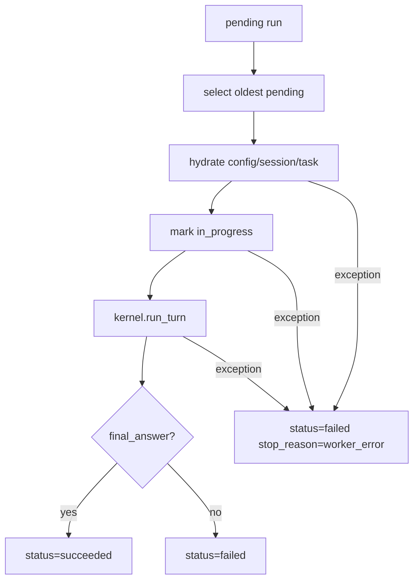

# 092-执行层-RunQueue-Worker Failure Handling

## 中文版：别让任务死在半路上

### 整体架构引用

参见：[000-总览-Harness-分层架构与连载目录](000-总览-Harness-分层架构与连载目录.md)。本文位于执行层和治理层交界处的 RunQueue / Worker 分支。

### 全局作用

RunQueue 属于执行层和治理层的交界处：它把“一次 CLI 调用”提升成“可排队、可诊断、可恢复的本地运行单元”。在没有 harness server 之前，本地 worker 就是最小的调度器。如果 worker 选中了一个 pending run，却因为状态加载、task 缺失或 kernel 构造失败而崩掉，这条 run 不能悬在 `pending` 或 `in_progress`，否则后续调度会越来越脏。

这个模块的目标很朴素：只要 worker 接管过一条 run，结果就必须落盘。成功就 `succeeded`，业务失败就 `failed`，worker 自身异常就 `worker_error`。

### 输入 / 输出 / 行为

- 输入：
  - `runs --run-next`：消费最早的 pending run。
  - `runs --run-until-empty`：持续消费 pending run。
  - `--session-dir` / `--task-dir` / `--memory-dir` / `--skill-dir` / `--artifact-dir` / `--hook-config`：worker 需要显式接入的本地状态目录。
- 输出：
  - 成功：JSON 中包含 `run_id`、`session_id`、`turn_id`、`stop_reason=final_answer`。
  - worker 异常：JSON 中包含 `status=failed`、`stop_reason=worker_error`、`error`、`error_type`。
  - run record metadata 中写入 `worker_error` 和 `worker_error_type`。
- 行为：
  - `run-next` 和 `run-until-empty` 共用同一个 `_run_queued_record`。
  - kernel 构造、task hydration、task 状态更新、turn 执行阶段的异常都会被落成 failed run。
  - JSON stdout 对成功和失败都保持机器可读。

### 实现原理与流程图

Worker 的核心原则是“认领即负责”。一条 pending run 被 worker 选中后，无论后面是模型成功、模型失败、task 缺失还是配置错误，都必须写回一个终态。否则队列会积累僵尸任务，server 化后会变成更难排查的并发问题。



### 过程记录

我们用一个缺失 task 的 queued run 做红测试。最初现象是 worker 直接退出，stdout 为空，run 还留在队列里。随后发现 `runs` 子命令还缺少 `--task-dir`，于是补齐 worker 显式状态目录参数。最后把 `_run_queued_record` 的 build、start、task update、turn execution 都包进错误归档逻辑，让异常变成可诊断的 failed run。

### 当前实现

| 项 | 状态 |
|---|---|
| 层 | 执行层 |
| 模块 | RunQueue |
| 子模块 | Worker Failure Handling |
| 实现状态 | 已实现 |
| 对应提交 | `6a5ccc4 Fail queued worker records cleanly` |

- 模块：`harness.runs.RunStore` + `harness.cli._run_queued_record`
- CLI：
  - `harness runs --run-next`
  - `harness runs --run-until-empty`
- 测试：
  - `tests/test_cli_smoke.py::test_cli_worker_marks_started_run_failed_on_exception`
  - run-next / drain 的既有 happy path 测试
- 真实验证：
  - 用 DeepSeek 跑了一条正常 queued worker，确认回归不影响真实执行路径。

### 测试例跑法

```bash
python3 -m pytest tests/test_cli_smoke.py::test_cli_worker_marks_started_run_failed_on_exception -q
python3 -m pytest tests/test_cli_smoke.py::test_cli_runs_can_run_next_pending_record tests/test_cli_smoke.py::test_cli_runs_can_drain_pending_records -q
```

读者验证点：第一条验证异常会归档成 failed run；第二条验证正常 worker 路径没有被破坏。

### 未来扩展计划

- 增加 stale `in_progress` 检测和 reclaim。
- 支持 worker lease / heartbeat，避免多 worker 并发抢同一条 run。
- 将 worker failure 分类为 config/state/model/tool/sandbox 几类，便于 server UI 聚合。
- 增加 retry policy，并把 retry 次数写入 run metadata。

## English Version

### Role In The Global Architecture

The run queue sits between execution and governance. It turns one-off CLI
invocations into durable local run records that can be queued, diagnosed, and
later served by a harness server. Once a worker selects a run, the run must end
in a persisted terminal state.

### Input / Output / Behavior

- Input: `runs --run-next` or `runs --run-until-empty`, plus explicit local state
  paths such as `--session-dir`, `--task-dir`, `--memory-dir`, `--skill-dir`,
  `--artifact-dir`, and `--hook-config`.
- Output: success returns a normal run payload; worker failures return
  `status=failed`, `stop_reason=worker_error`, and error metadata.
- Behavior: setup, hydration, task update, and turn execution errors are recorded
  as failed runs instead of leaving records pending or in progress.

### Implementation Notes

`_run_queued_record` is the shared worker helper for both single-run and drain
workers. Tests simulate a missing task id and verify that the selected run
becomes failed with `worker_error` metadata. A live DeepSeek queued run validated
the happy path after the failure-handling change.

### Future Work

Stale-run reclaim, worker leases, failure taxonomy, and retry policy.
