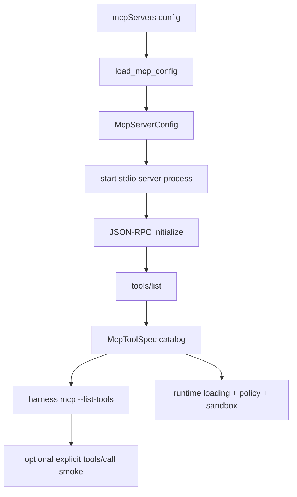

# 094-控制平面-MCP-Client Catalog

## 中文版：先把 MCP 资产同步清楚

### 全局作用

参见：[000-总览-Harness-分层架构与连载目录](000-总览-Harness-分层架构与连载目录.md)。本文位于 Agent Control Plane 的 Tool / MCP Registry 分支，并为后续 Harness Runtime 的 MCP Tool Loading 做准备。

MCP Client Catalog 解决的问题不是“让模型立刻调用所有外部 MCP 工具”，而是先把 MCP server 的配置、生命周期、握手、工具列表和单工具调用跑成可验证闭环。注册层负责发现和同步能力；真正进入模型工具池之前，还要经过 runtime loading、policy、sandbox 和 trace。

### 输入 / 输出 / 行为

- 输入：Claude/Codex 风格的 `mcpServers` JSON 配置。
- 输出：`McpServerConfig`、`McpToolSpec`，以及 CLI 可读或 JSON 格式的工具清单。
- 行为：
  - 读取本地 MCP 配置。
  - 启动 stdio MCP server 子进程。
  - 执行 `initialize` 握手。
  - 调用 `tools/list` 同步工具 schema。
  - 支持通过 CLI 显式调用单个 MCP tool 做烟测。
- 失败模式：配置字段缺失、server 启动失败、协议响应错误、超时、工具返回 `isError`。

### 实现原理与流程图

MCP stdio transport 使用 JSON-RPC 消息。当前实现保持最小 client：每次检查一个 server 时启动进程，发送 `initialize`，再发送 `tools/list` 或 `tools/call`。它不把 MCP tool 自动注册成模型可见工具，原因是外部 MCP server 可能读写宿主机、访问网络或触发业务系统，必须先接入工具级权限和 sandbox 策略。



### 当前实现

| 项 | 状态 |
|---|---|
| 层 | Agent Control Plane |
| 模块 | MCP Client Catalog |
| 子模块 | Config Loader / Stdio Client / CLI Inspector |
| 实现状态 | 已实现最小可验证版本 |
| 对应提交 | 本轮实现 |

- `src/harness/mcp.py`：`McpServerConfig`、`McpToolSpec`、`McpStdioClient`、`load_mcp_config`、`list_mcp_tools`。
- `harness mcp --mcp-config ... --list-tools --json`：同步并打印 MCP 工具清单。
- `harness mcp --mcp-config ... --server ... --call-tool ... --args-json ...`：显式调用单个 MCP tool。
- 安全边界：当前模块是 catalog/client，不自动注入 agent runtime；后续注入时必须接 policy、sandbox、trace。

### 横向对标

| Harness | 对应实现 | 实现原理 |
|---|---|---|
| Claude Code | MCP config scopes、server lifecycle、tools/resources/prompts sync | MCP 是一等资产，会按配置范围和权限模式进入工具池。 |
| Codex | MCP servers、ToolRouter、plugin marketplace | MCP server 属于控制面资产，runtime 每 turn 决定哪些工具进入模型上下文。 |
| OpenClaw | mcporter / plugin bridge | MCP 通过桥接方式接入，核心 runtime 不完全绑定 MCP 协议变化。 |
| Hermes Agent | MCP config、tool registry、stdio/http/SSE backend | MCP server 可动态注册到工具表，并结合多 sandbox 后端执行。 |

本仓库先实现 stdio client catalog，是为了把协议握手和工具 schema 同步讲清楚。和产品级 Harness 相比，当前还没有做多 transport、resources/prompts、server 级权限、自动 runtime injection 和 MCP tool sandbox wrapper。

### 测试例跑法

```bash
PYTHONPATH=src python3 -m pytest tests/test_mcp.py -q
```

读者验证点：测试会启动一个真实本地 stdio MCP server 子进程，验证配置解析、`initialize`、`tools/list`、`tools/call` 和 CLI JSON 输出。

### 后续扩展

- 将 MCP tool 转成 runtime tool definition，并按 profile 暴露给模型。
- 为 MCP server 增加 sandbox runner 包裹，sandbox 不可用时 fail closed。
- 支持 resources、prompts、HTTP/SSE transport。
- 在 trace/audit 中记录 server、tool、schema version、调用结果和失败原因。

## English Version

MCP Client Catalog is the control-plane step for discovering MCP capabilities.
It loads Claude/Codex-style `mcpServers` config, starts stdio servers, performs
JSON-RPC initialization, lists tool schemas, and optionally calls one tool for a
smoke test. Runtime injection is intentionally left for the next layer, where
policy, sandbox, and trace can wrap external tools safely.
