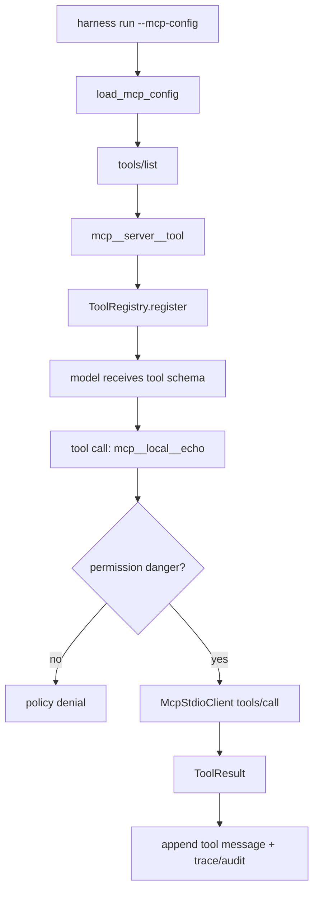

# 095-运行时层-MCP-Runtime Loading

## 中文版：让 MCP 工具进入 Agent Turn

### 全局作用

参见：[000-总览-Harness-分层架构与连载目录](000-总览-Harness-分层架构与连载目录.md)。本文位于 Harness Runtime 的 Tool / MCP Client 分支，承接 [094-控制平面-MCP-Client Catalog](094-控制平面-MCP-Client%20Catalog.md)。

MCP Runtime Loading 解决的问题是：MCP server 已经能被发现和同步 schema 后，如何把这些外部工具安全地暴露给当前 turn。这里的关键不是“全部注册进去”，而是 namespacing、权限门禁、显式配置和可追踪调用。

### 输入 / 输出 / 行为

- 输入：`--mcp-config` 或 `HARNESS_MCP_CONFIG` 指向的 `mcpServers` 配置。
- 输出：运行时工具名，例如 `mcp__local__echo`。
- 行为：
  - CLI run 显式加载 MCP 配置。
  - Kernel 启动前同步 MCP tool schema。
  - 每个 MCP tool 转成 namespaced `Tool`。
  - MCP tool 默认要求 `danger` 权限。
  - MCP tool metadata 标记为 `category=mcp`、`sandbox_required=true`。
  - 模型发起 tool call 后，runtime 通过 stdio MCP client 调用原始 MCP tool。
- 失败模式：MCP 配置缺失、server 超时、schema 冲突、权限不足、工具协议错误、工具返回 `isError`。

### 实现原理与流程图

控制平面负责 catalog，运行时负责注入。当前实现用 `register_mcp_tools` 把 MCP tool 转成内置 `ToolRegistry` 的工具对象，工具名由 `mcp__{server}__{tool}` 组成，避免和内置工具重名。每次工具调用都会新建 MCP stdio client、执行 `tools/call`，并通过现有 Kernel 的 tool loop、policy、trace 和 audit 路径回填结果。



### 当前实现

| 项 | 状态 |
|---|---|
| 层 | Harness Runtime |
| 模块 | MCP Runtime Loading |
| 子模块 | Runtime Tool Injection / Namespacing / Policy Gate |
| 实现状态 | 已实现最小可验证版本 |
| 对应提交 | 本轮实现 |

- `register_mcp_tools(registry, configs)`：将 MCP tools 注册到当前运行时工具池。
- `mcp_tool_runtime_name(server, tool)`：生成稳定的 namespaced 工具名。
- `HarnessConfig.mcp_config`：支持 config/env/CLI 合并。
- `harness run --mcp-config ...`：将 MCP tools 暴露给当前 agent turn。
- 安全边界：MCP runtime tool 默认要求 `danger` 权限，并标记 `sandbox_required=true`。当前尚未把 MCP server 子进程放入 sandbox runner；因此它是显式高风险能力，不会默认开启。

### 横向对标

| Harness | 对应实现 | 实现原理 |
|---|---|---|
| Claude Code | MCP config scopes、tool permission、runtime tool pool | MCP server 能按用户/项目/本地范围配置，runtime 将 tool/resources/prompts 同步进可用能力池，并结合权限模式执行。 |
| Codex | MCP servers、ToolRouter、permission profile | MCP 属于配置层资产，runtime 每 turn 将可见工具交给 ToolRouter，并和 sandbox/approval/profile 一起控制。 |
| OpenClaw | mcporter / plugin bridge、session routing | MCP 更像桥接能力，运行时通过 gateway/plugin slot 接入，避免核心 agent loop 直接绑定协议变化。 |
| Hermes Agent | MCP config、tool registry、delegate runtime | MCP 可动态进入 tool registry，并和多执行后端、approval、trajectory 记录结合。 |

本仓库当前实现对齐的是“runtime 可用工具池”这一最小闭环：MCP tool 能进入 Kernel、能被模型调用、能经过 policy、能回填 session。与产品级 Harness 相比，还缺少 server 级 sandbox、resources/prompts、长期连接复用、schema version trace、多 transport 和企业级权限模型。

### 测试例跑法

```bash
PYTHONPATH=src python3 -m pytest tests/test_mcp.py -q
```

读者验证点：测试会启动真实 stdio MCP server，验证工具 namespacing、权限拒绝、`danger` 权限下的实际调用、Kernel tool loop 回填，以及 `harness run --mcp-config` 的 CLI 闭环。

### 后续扩展

- 为 MCP server 进程接入 sandbox runner，sandbox 不存在时 fail closed。
- 支持 MCP resources/prompts，并区分资源读取权限和工具执行权限。
- 复用长连接，减少每次 tool call 重新启动 server 的成本。
- 将 MCP server、tool name、schema hash、调用结果写入结构化 trace/audit。

## English Version

MCP Runtime Loading turns cataloged MCP tools into namespaced runtime tools for
one agent turn. The current implementation registers explicit MCP tools into
the local `ToolRegistry`, gates them behind `danger` permission, and routes
calls through the existing kernel tool loop. The next production step is to
wrap MCP server processes with sandbox and richer trace metadata.
