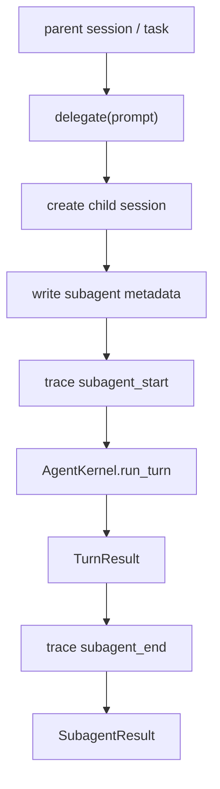

# 096-运行时层-Subagent-Delegate Runner

## 中文版：把一个任务交给子 Agent

### 全局作用

参见：[000-总览-Harness-分层架构与连载目录](000-总览-Harness-分层架构与连载目录.md)。本文位于 Harness Runtime / Agent Control Plane 的 Multi-agent / Subagent 分支。

Subagent Delegate Runner 解决的是多 Agent 的最小可运行闭环：父任务可以把一个子任务交给一个具名 subagent，subagent 拥有自己的 session、权限、turn、trace 事件和最终结果。它不是完整 workflow engine，也不是多节点调度系统；它先把 spawn、run、result、trace 四件事做稳。

### 输入 / 输出 / 行为

- 输入：`SubagentSpec`、子任务 prompt、可选父 session id。
- 输出：`SubagentResult`，包含 child session id、turn id、final text、stop reason、iterations。
- 行为：
  - 创建新的 child session。
  - 写入 `subagent_name` 与 `parent_session_id` metadata。
  - 记录 `subagent_start` trace。
  - 使用 `AgentKernel` 执行子任务。
  - 默认以 `read-only` 权限运行，除非 spec 显式提升。
  - 记录 `subagent_end` trace 并返回结果。
- 失败模式：子模型错误、工具权限不足、子任务达到 max iterations、工具错误、session store 写入失败。

### 实现原理与流程图

Subagent 不复用父 session 的上下文窗口，而是新建 child session。这样可以清楚地区分父任务和子任务的状态、权限和 trace。当前实现把 subagent 看作一个薄封装：它内部仍然调用同一个 `AgentKernel`，只是用 `SubagentSpec` 控制名字、权限和最大迭代次数。



### 当前实现

| 项 | 状态 |
|---|---|
| 层 | Harness Runtime / Agent Control Plane |
| 模块 | Subagent / Multi-agent |
| 子模块 | Delegate Runner |
| 实现状态 | 已实现最小可验证版本 |
| 对应提交 | 本轮实现 |

- `SubagentSpec`：定义子 Agent 名字、权限和最大迭代次数。
- `SubagentRunner.delegate(...)`：创建 child session 并运行子任务。
- `SubagentResult`：返回 child session、turn 和最终结果。
- Trace：`subagent_start`、`subagent_end`。
- 权限：默认 `read-only`，避免子 Agent 自动继承父任务的高权限。

### 横向对标

| Harness | 对应实现 | 实现原理 |
|---|---|---|
| Claude Code | AgentTool、LocalAgentTask、forked agent、sidechain transcript | 子 Agent 有独立 transcript，可用于并行探索、接力和隔离上下文。 |
| Codex | multi_agents / multi_agents_v2、roles、trace reducer | 子 Agent 通常有角色、权限和父子 trace 汇总，用于复杂任务分解。 |
| OpenClaw | session spawn、multi-agent routing、sandbox inheritance | 通过 session protocol 生成子会话，并约束 depth、thread、sandbox 继承。 |
| Hermes Agent | `delegate_task`、kanban durable worker | 子任务可进入 durable queue，由 worker 处理并回传结果。 |

本仓库当前实现选择最小 delegate runner，是为了先把父子 session、权限收缩和 trace 关联讲清楚。与产品级 Harness 相比，暂时还没有做并行 fan-out、子 Agent registry、结果 reducer、worktree isolation、durable worker 和跨进程调度。

### 测试例跑法

```bash
PYTHONPATH=src python3 -m pytest tests/test_subagents.py -q
```

读者验证点：测试会验证子 session metadata、`subagent_start/subagent_end` trace，以及默认 read-only 权限下子 Agent 不能写 workspace。

### 后续扩展

- 增加 subagent registry 和角色模板。
- 将 delegate runner 包装成父 Agent 可调用的 `delegate_task` 工具。
- 支持并行 fan-out、结果 reducer 和失败补偿。
- 为每个 subagent 分配独立 worktree 或 sandbox profile。

## English Version

Subagent Delegate Runner provides the minimal parent-child agent loop. It creates
a child session, runs a task through `AgentKernel`, records start/end trace
events, and returns a structured result. The default permission is read-only so
child agents do not silently inherit powerful parent capabilities.
