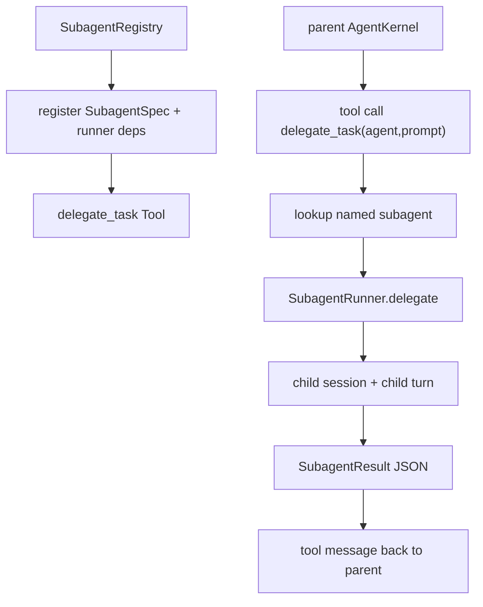

# 097-控制平面-Subagent-Delegate Task Tool

## 中文版：把子 Agent 变成父 Agent 的工具

### 全局作用

参见：[000-总览-Harness-分层架构与连载目录](000-总览-Harness-分层架构与连载目录.md)。本文位于 Agent Control Plane 的 Agent Registry 分支，同时连接 Harness Runtime 的 Subagent / Multi-agent 分支。

Delegate Task Tool 解决的问题是：父 Agent 不应该只能由宿主程序手动调用 subagent runner，它应该能像调用普通工具一样，把一个子任务交给具名 subagent。这样 subagent 从 SDK 能力变成运行时能力，后续才能演进到任务分解、并行 fan-out 和结果汇总。

### 输入 / 输出 / 行为

- 输入：`agent`、`prompt`。
- 输出：JSON 字符串，包含子 Agent 名字、child session id、turn id、stop reason、iterations、final text。
- 行为：
  - `SubagentRegistry` 注册具名 subagent。
  - `delegate_task` 作为普通 `Tool` 注册到父 Agent 的工具池。
  - 父 Agent 发起 `delegate_task` tool call。
  - registry 找到对应 runner，创建 child session 并执行子任务。
  - 子任务结果作为 tool message 回填给父 Agent。
- 失败模式：未知 subagent、子任务模型错误、子任务工具权限不足、子任务达到 max iterations。

### 实现原理与流程图

`SubagentRegistry` 管理具名 runner，并提供 `delegate_task_tool()`。这个 tool 本身只需要 read-only 权限，因为它不直接修改 workspace；真正的子 Agent 权限由 `SubagentSpec.permission` 控制。这样父 Agent 是否可以委托、子 Agent 能做什么，是两个不同的治理问题。



### 当前实现

| 项 | 状态 |
|---|---|
| 层 | Agent Control Plane / Harness Runtime |
| 模块 | Agent Registry / Subagent |
| 子模块 | Delegate Task Tool |
| 实现状态 | 已实现最小可验证版本 |
| 对应提交 | 本轮实现 |

- `SubagentRegistry.register(...)`：注册具名 subagent runner。
- `SubagentRegistry.delegate(...)`：按名字执行子任务。
- `SubagentRegistry.delegate_task_tool(...)`：生成父 Agent 可调用的 `delegate_task` 工具。
- 工具输出是结构化 JSON，方便父 Agent 继续推理。
- 子 Agent 权限仍由 `SubagentSpec` 控制，默认 read-only。

### 横向对标

| Harness | 对应实现 | 实现原理 |
|---|---|---|
| Claude Code | AgentTool / Task tool | 父 Agent 通过工具启动 sidechain/forked agent，子 transcript 独立，结果回到父上下文。 |
| Codex | multi_agents roles / parent-child trace | 子 Agent 以角色和任务为单位执行，父侧做 trace 汇总和结果归并。 |
| OpenClaw | `sessions_spawn` / multi-agent routing | 通过 session protocol 生成子会话，并受 depth/thread/sandbox 继承规则约束。 |
| Hermes Agent | `delegate_task` / kanban worker | 父 Agent 可把任务委托到 worker 或 durable queue，子任务结果回传。 |

本仓库当前实现对齐的是“父 Agent 能把子 Agent 当工具调用”的最小能力。与产品级 Harness 相比，还没有做 durable queue、并发 fan-out、结果 reducer、子 Agent 生命周期 UI、worktree isolation 和跨进程 worker。

### 测试例跑法

```bash
PYTHONPATH=src python3 -m pytest tests/test_subagents.py -q
```

读者验证点：测试会验证 `delegate_task` 被父 Kernel 调用，子 Agent 产生 child session，结果 JSON 回填给父 Agent，并保留父子 metadata。

### 后续扩展

- 将 subagent registry 接入 CLI/config。
- 支持多个 subagent 并行执行和 result reducer。
- 将 delegate_task 与 run queue/task ledger 结合，形成 durable subtask。
- 为子 Agent 增加独立 workspace/worktree isolation。

## English Version

Delegate Task Tool turns a registered subagent into a normal parent-agent tool.
The parent kernel calls `delegate_task`, the registry runs the named child agent,
and the structured result is returned as a tool message. The child agent keeps
its own session and permission profile.
