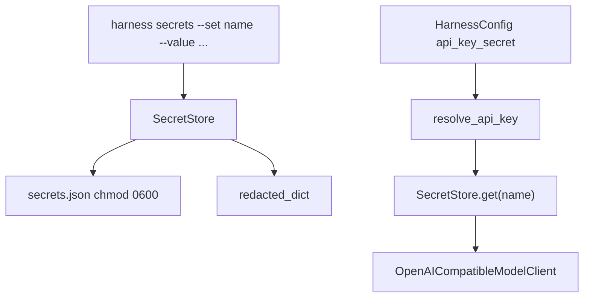

# 098-执行安全层-Secrets-Credentials Store

## 中文版：不要把密钥散落在配置里

### 全局作用

参见：[000-总览-Harness-分层架构与连载目录](000-总览-Harness-分层架构与连载目录.md)。本文位于 Execution & Security Infrastructure 的 Secrets / Credentials 分支。

Secrets Store 解决的是本地 Harness 的凭证边界问题。模型 API key、业务系统 token、MCP server credential 这类值不能长期散落在普通 config、trace、README 示例或 shell history 里。Phase 1 先实现一个轻量本地 secret store，让配置可以引用 secret name，而不是直接保存明文。

### 输入 / 输出 / 行为

- 输入：secret name、secret value、`secret_store` 路径、`api_key_secret` 引用。
- 输出：本地 secrets JSON 文件、redacted list、运行时解析出的 API key。
- 行为：
  - CLI 可 set/get/list/delete secret。
  - list/json 输出默认 redacted。
  - POSIX 系统写入后将 secret 文件权限设为 `0600`。
  - `resolve_api_key` 优先使用显式 `api_key`，否则按 `api_key_secret` 从 store 解析。
  - `harness run` 和 memory extraction 使用同一套解析逻辑。
- 失败模式：secret name 为空、secret value 为空、secret store JSON 损坏、引用的 secret 不存在。

### 实现原理与流程图

Secret store 是一个本地 JSON object，key 是规范化后的 secret name，value 是明文 secret。它不是生产级 KMS，也不声称能抵抗本机用户读取；它的价值是把密钥从普通配置和文档示例中移出，并让后续接入 macOS Keychain、1Password、Vault 或云 KMS 时有稳定接口。



### 当前实现

| 项 | 状态 |
|---|---|
| 层 | Execution & Security Infrastructure |
| 模块 | Secrets / Credentials |
| 子模块 | Local Secret Store |
| 实现状态 | 已实现最小可验证版本 |
| 对应提交 | 本轮实现 |

- `SecretStore`：set/get/list/delete/redacted。
- `HarnessConfig.secret_store`：默认 `.harness/secrets.json`。
- `HarnessConfig.api_key_secret`：让 config 引用 secret name。
- `HARNESS_SECRET_STORE`、`HARNESS_API_KEY_SECRET`：环境变量覆盖。
- CLI：`harness secrets --set/--get/--delete/--list --json`。

### 横向对标

| Harness | 对应实现 | 实现原理 |
|---|---|---|
| Claude Code | secure storage、permission hooks、MCP credential handling | 凭证通常不直接进 prompt，通过本地安全存储和工具权限边界控制读取。 |
| Codex | keyring、approval cache、sandbox env filtering | 本地 credential 与运行时环境分离，高风险执行环境会过滤父进程敏感变量。 |
| OpenClaw | auth profiles、secrets、gateway auth | 多端/多通道场景下凭证跟 auth profile 和 gateway 绑定，不直接暴露给前端。 |
| Hermes Agent | secrets、sandbox backend credentials、provider config | 多执行后端需要把 provider key、sandbox token、connector credential 分层管理。 |

本仓库当前实现选择本地 JSON + `0600`，是为了先建立接口和测试，不提前引入平台依赖。与产品级 Harness 相比，还没有接 Keychain/KMS、secret scope、rotation、audit on read、per-tool credential injection。

### 测试例跑法

```bash
PYTHONPATH=src python3 -m pytest tests/test_secrets.py tests/test_config.py -q
```

读者验证点：测试会验证 secret set/get/list/delete、redacted 输出、POSIX `0600` 文件权限、`api_key_secret` 解析优先级和 CLI 管理流程。

### 后续扩展

- 接入 macOS Keychain 或系统 keyring。
- 为 secret 增加 workspace/project/user scope。
- 将 secret read 写入 audit，避免无痕读取。
- 支持 tool-level credential injection，避免把 secret 注入整个 Agent 进程。

## English Version

Secrets Store provides a small local credential boundary. It stores named
secrets in a chmod-600 JSON file, lets config reference `api_key_secret`, and
keeps listing output redacted. It is a Phase 1 interface, not a production KMS.
