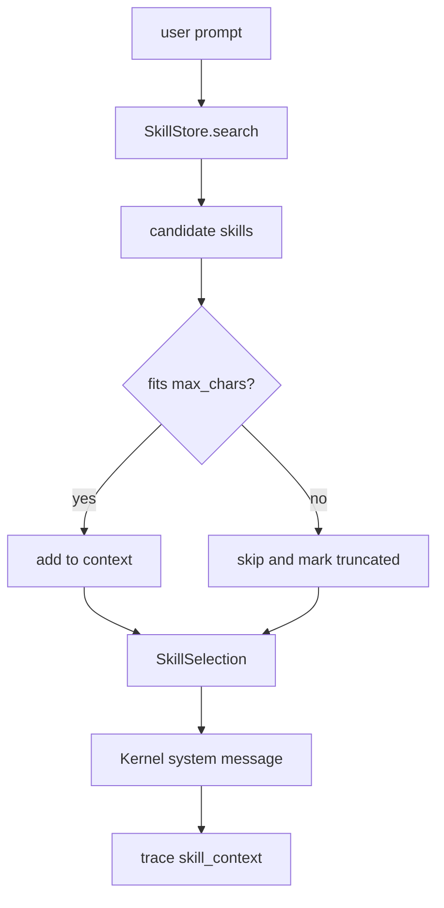

# 099-运行时层-Skill-Runtime Selection Trace

## 中文版：Skill 注入要可预算、可追踪

### 全局作用

参见：[000-总览-Harness-分层架构与连载目录](000-总览-Harness-分层架构与连载目录.md)。本文位于 Harness Runtime 的 Skill Runtime / Context Injection 分支。

Skill Registry 负责管理可复用经验，Skill Runtime 负责在每个 turn 决定哪些 skill 进入上下文。这个阶段的关键不是“把所有 skill 都塞进去”，而是按当前任务检索、按预算裁剪，并把注入来源记录到 trace，方便之后复盘为什么模型看到了某个 skill。

### 输入 / 输出 / 行为

- 输入：用户 prompt、skill search limit、可选 `max_chars` 预算。
- 输出：`SkillSelection`，包含 context、skill names、char count、truncated 标记。
- 行为：
  - `SkillStore.search` 仍负责相关性排序。
  - `SkillStore.select_context` 负责预算内选择和 metadata。
  - Kernel 将 selection context 注入 system message。
  - Kernel 记录 `skill_context` trace 事件。
- 失败模式：没有匹配 skill、skill 内容超过预算被跳过、预算过小导致不注入、skill 文件损坏。

### 实现原理与流程图

Skill Runtime 把“检索”和“注入”拆开：检索返回候选 skill，selection 再逐个尝试加入 context。如果加入某个 skill 会超过 `max_chars`，该 skill 会被跳过，并将 `truncated=true` 写入 selection。Kernel 只在 context 非空时注入，并记录 names/char_count/truncated。



### 当前实现

| 项 | 状态 |
|---|---|
| 层 | Harness Runtime |
| 模块 | Skill Runtime |
| 子模块 | Runtime Selection / Budget / Trace |
| 实现状态 | 已实现最小可验证版本 |
| 对应提交 | 本轮实现 |

- `SkillSelection`：保存 context、names、char_count、truncated。
- `SkillStore.select_context(...)`：按 limit 和 max_chars 生成 runtime context。
- `AgentKernel.skill_context_limit`：控制每 turn 最多注入几个 skill。
- `AgentKernel.skill_context_max_chars`：控制 skill context 字符预算。
- Trace：`skill_context` 记录 names、char_count、truncated。

### 横向对标

| Harness | 对应实现 | 实现原理 |
|---|---|---|
| Claude Code | Skill runtime、managed/user/project skills、context loading | skill 不只是注册资产，运行时会按任务和上下文预算选择加载，并和 memory/compact 共同工作。 |
| Codex | skill loader、plugin injection、AGENTS.md/context rules | skill/plugin 信息在 turn 构造阶段注入，和 config/profile/history manager 一起决定模型可见上下文。 |
| OpenClaw | skills gating、AgentSkills compatibility | skill 作为可门控能力进入 session/context engine，避免所有 skill 无差别暴露。 |
| Hermes Agent | skills hub、optional skills、memory manager | skill 与 memory 自学习结合，运行时选择和长期迭代是核心能力之一。 |

本仓库当前实现覆盖了 runtime selection、预算裁剪和 trace 来源。与产品级 Harness 相比，还没有做 token 级预算、skill 版本 pin、skill 依赖工具声明、自动 skill 改写和基于历史效果的 ranking。

### 测试例跑法

```bash
PYTHONPATH=src python3 -m pytest tests/test_skills.py tests/test_kernel.py::test_kernel_traces_skill_runtime_selection -q
```

读者验证点：测试会验证超预算 skill 被跳过、selection metadata 正确、Kernel 注入相关 skill，并在 trace 中记录 `skill_context`。

### 后续扩展

- 将字符预算替换为 token budget。
- 给 skill 增加版本、source、tool requirements。
- 将 skill_context trace 接入 eval，评估 skill 是否真的帮助任务完成。
- 支持 memory 到 skill 的候选提升和自动沉淀。

## English Version

Skill Runtime Selection turns registered skills into bounded, traceable context.
It selects relevant skills, skips entries that exceed the runtime budget, injects
the selected context into the kernel prompt, and records a `skill_context` trace
event for debugging and evaluation.
