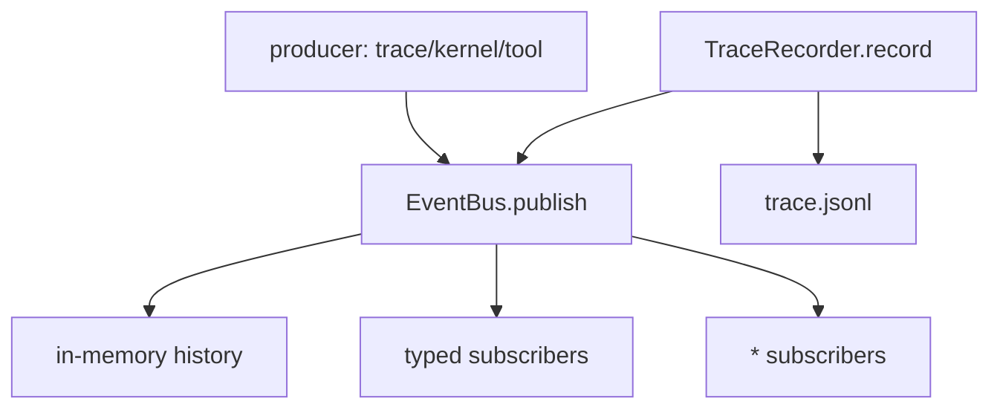

# 100-执行安全层-Event Bus-In Process Events

## 中文版：先有本地事件流，再谈服务化

### 全局作用

参见：[000-总览-Harness-分层架构与连载目录](000-总览-Harness-分层架构与连载目录.md)。本文位于 Execution & Security Infrastructure 的 Event Bus 分支，也服务于 Observability / Evaluation / Ops。

Event Bus 解决的是模块之间的事件分发问题。当前 Harness 已经有 trace JSONL，但 trace 是持久化事实，不等于运行时事件流。In-process EventBus 先提供 `publish/subscribe/history`，让 trace、hooks、未来 streaming/server 可以共享同一条事件通道。

### 输入 / 输出 / 行为

- 输入：event type 和事件 payload。
- 输出：带 `ts` 和 `type` 的事件对象。
- 行为：
  - 支持按事件类型订阅。
  - 支持 `*` 通配订阅。
  - 保留本地内存 history。
  - `TraceRecorder` 可选接入 EventBus，record trace 时同步 publish。
- 失败模式：handler 抛错会向调用方冒泡；当前没有后台队列、重试和隔离。

### 实现原理与流程图

EventBus 是单进程同步分发器。它不做网络、不做 daemon、不做持久化。TraceRecorder 仍然负责 JSONL 落盘；EventBus 只负责运行时 fan-out。这个边界可以避免把本地 harness 提前复杂化，同时为之后 Harness Server 的 stream API 留出接口。



### 当前实现

| 项 | 状态 |
|---|---|
| 层 | Execution & Security Infrastructure |
| 模块 | Event Bus |
| 子模块 | In-process Events |
| 实现状态 | 已实现最小可验证版本 |
| 对应提交 | 本轮实现 |

- `EventBus.subscribe(event_type, handler)`：订阅事件。
- `EventBus.publish(event_type, **data)`：发布事件并写入 history。
- `EventBus.history(...)`：查询内存事件。
- `TraceRecorder(..., event_bus=bus)`：trace record 同步 publish。

### 横向对标

| Harness | 对应实现 | 实现原理 |
|---|---|---|
| Claude Code | SDK streams、tool streaming、analytics events | 运行时事件被用于 UI/SDK stream、诊断、成本和质量治理。 |
| Codex | rollout trace、exec-server events、app server stream | 事件贯穿 CLI、桌面、exec server 和 trace reducer。 |
| OpenClaw | gateway logs、diagnostic events、message bus | 多通道/多节点架构中，event bus 是 session routing 和诊断基础。 |
| Hermes Agent | trajectories、batch runner、Langfuse plugin | 运行轨迹事件既用于调试，也用于后续压缩、评估和学习。 |

本仓库当前实现只做 in-process 同步事件，适合本地 harness。与产品级 Harness 相比，还没有 topic ACL、异步队列、持久化 event store、跨进程 stream、OTel bridge 和 backpressure。

### 测试例跑法

```bash
PYTHONPATH=src python3 -m pytest tests/test_event_bus.py -q
```

读者验证点：测试会验证 typed subscriber、通配 subscriber、history 查询，以及 TraceRecorder record 时同步发布事件。

### 后续扩展

- 将 audit、hooks、run ledger 也接到 EventBus。
- 增加异步队列和 handler 错误隔离。
- 为 Harness Server 提供 SSE/WebSocket stream。
- 增加 OTel exporter。

## English Version

In-process EventBus provides a minimal runtime event stream for local harness
modules. It supports typed and wildcard subscriptions, in-memory history, and
optional TraceRecorder publishing. Persistence remains the responsibility of
trace JSONL.
