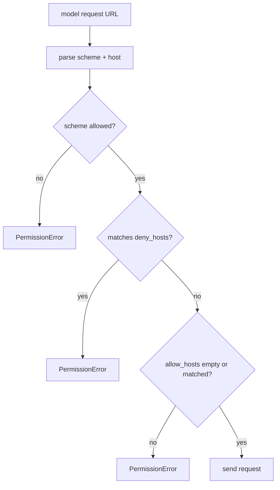

# 101-执行安全层-Network Policy-Model Egress

## 中文版：模型出口也要有边界

### 全局作用

参见：[000-总览-Harness-分层架构与连载目录](000-总览-Harness-分层架构与连载目录.md)。本文位于 Execution & Security Infrastructure 的 Network Policy 分支。

Network Policy 解决的是本地 Harness 的网络出口治理问题。即使 Phase 1 不做完整代理和企业网关，也不能让模型 endpoint、未来 HTTP MCP、浏览器工具、业务 connector 都无约束访问任意 host。本轮先把 model egress 的 allow/deny host 策略跑通。

### 输入 / 输出 / 行为

- 输入：目标 URL、allow host patterns、deny host patterns。
- 输出：允许通过，或抛出 `PermissionError`。
- 行为：
  - 默认只允许 `https` scheme。
  - `deny_hosts` 优先于 `allow_hosts`。
  - `allow_hosts` 非空时，目标 host 必须匹配。
  - host pattern 支持 `*.example.com` 这类通配。
  - OpenAI-compatible model client 发请求前检查 URL。
- 失败模式：URL 无 host、scheme 不允许、host 命中 deny、host 不在 allow 范围。

### 实现原理与流程图

`NetworkPolicy` 是一个轻量同步校验器。它不负责真正建立网络连接，也不替代系统防火墙；它在 Harness 发起外部请求之前做 host/scheme 级前置判断。当前先接入 model client，后续可复用到 HTTP MCP、browser runner 和 connector。



### 当前实现

| 项 | 状态 |
|---|---|
| 层 | Execution & Security Infrastructure |
| 模块 | Network Policy |
| 子模块 | Model Egress |
| 实现状态 | 已实现最小可验证版本 |
| 对应提交 | 本轮实现 |

- `NetworkPolicy.check_url(...)`：校验 scheme/host。
- `OpenAICompatibleModelClient.network_policy`：请求前执行检查。
- `HarnessConfig.network_allow_hosts` / `network_deny_hosts`：配置化。
- `HARNESS_NETWORK_ALLOW_HOSTS` / `HARNESS_NETWORK_DENY_HOSTS`：环境变量覆盖。
- CLI：`harness run --network-allow-host ... --network-deny-host ...`。

### 横向对标

| Harness | 对应实现 | 实现原理 |
|---|---|---|
| Claude Code | permission modes、web fetch/search 权限、MCP scope | 网络能力通常通过工具权限和 MCP/server scope 控制，不让任意请求无边界发出。 |
| Codex | network proxy、sandbox network policy、approval profile | 执行环境和模型/工具出口可按 profile 受限，网络访问不是默认裸奔。 |
| OpenClaw | gateway / channel auth、browser sandbox、connector policy | 多通道 agent 通过 gateway 和插件层限制外部系统访问范围。 |
| Hermes Agent | sandbox backend、provider config、connector credentials | 不同执行后端和 connector 需要不同出口策略和 credential 注入方式。 |

本仓库当前实现覆盖 model egress 的最小 allow/deny host 策略。与产品级 Harness 相比，还没有 DNS/IP 级限制、HTTP MCP transport policy、browser 域名白名单、代理、审计和 per-tool network scope。

### 测试例跑法

```bash
PYTHONPATH=src python3 -m pytest tests/test_network_policy.py tests/test_model_client.py::test_openai_client_checks_network_policy_before_request tests/test_config.py -q
```

读者验证点：测试会验证 host allow/deny、HTTP scheme 拒绝、deny 优先、model client 请求前拦截，以及 config/env 字段加载。

### 后续扩展

- 接入 HTTP MCP transport 和 connector。
- 增加 per-tool network scope。
- 将拒绝事件写入 audit/trace。
- 支持代理、DNS/IP 范围和企业网关。

## English Version

Network Policy provides a small egress boundary for local harness requests. It
checks URL scheme and host allow/deny patterns before the OpenAI-compatible
model client sends a request. Later layers can reuse the same policy for HTTP
MCP, browser tools, and business connectors.
