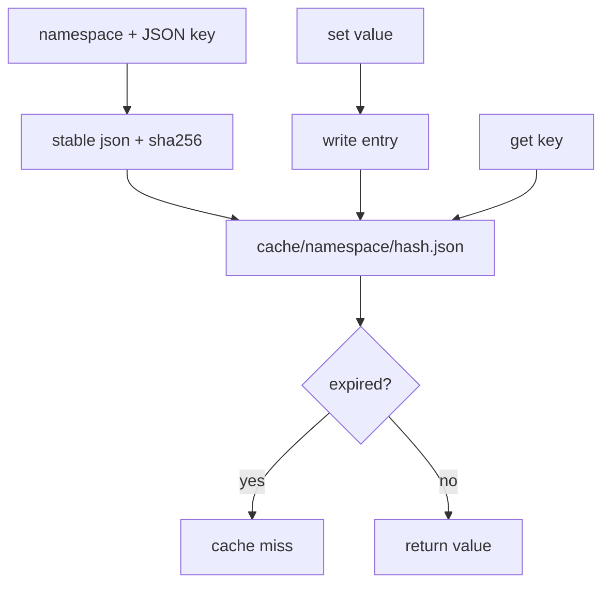

# 102-执行安全层-Cache-File Cache

## 中文版：先做可控的本地缓存

### 全局作用

参见：[000-总览-Harness-分层架构与连载目录](000-总览-Harness-分层架构与连载目录.md)。本文位于 Execution & Security Infrastructure 的 Cache 分支。

Cache 解决的是重复计算、重复读取和后续检索加速的问题。当前不直接缓存模型响应，因为模型缓存涉及 prompt、tools、policy、memory、skill、权限上下文等复杂一致性；本轮先实现通用 FileCache，为后续 tool cache、retrieval cache、model cache 提供可测试基础。

### 输入 / 输出 / 行为

- 输入：namespace、JSON key、JSON value、可选 TTL。
- 输出：本地 cache entry 文件。
- 行为：
  - key 使用稳定 JSON 序列化后做 SHA-256。
  - 按 namespace 分目录保存。
  - 支持 set/get/delete/list/clear。
  - TTL 过期后 get 返回 miss。
  - CLI 可管理 cache。
- 失败模式：key/value 不是合法 JSON、entry 文件损坏、TTL 过期、namespace 为空。

### 实现原理与流程图

FileCache 将 key 标准化为稳定 JSON，再计算 hash，避免直接把长 prompt 或敏感 key 放进文件名。每个 entry 保存 namespace、key、key_hash、value、created_at、expires_at。它是底层能力，不擅自替上层决定什么可以缓存。



### 当前实现

| 项 | 状态 |
|---|---|
| 层 | Execution & Security Infrastructure |
| 模块 | Cache |
| 子模块 | File Cache |
| 实现状态 | 已实现最小可验证版本 |
| 对应提交 | 本轮实现 |

- `FileCache.set/get/delete/list_entries/clear`。
- `CacheEntry`：namespace、key_hash、created_at、expires_at、path。
- `HarnessConfig.cache_dir`：默认 `.harness/cache`。
- CLI：`harness cache --set-json/--get/--list/--clear`。

### 横向对标

| Harness | 对应实现 | 实现原理 |
|---|---|---|
| Claude Code | prompt caching aware context、tool output trimming | 缓存策略和模型 KV/prompt cache 自洽，避免上下文管理破坏缓存命中。 |
| Codex | rollout-derived memory、state DB、trace reducer cache | 本地状态和 rollout trace 会被复用到诊断、记忆和评估路径。 |
| OpenClaw | gateway cache trace、context engine cache | 多通道 gateway 需要缓存上下文、工具结果和诊断事件。 |
| Hermes Agent | state.db、FTS5 session search、trajectory compression | cache 和本地 DB 支撑长程会话搜索、压缩和批处理。 |

本仓库当前实现只是底层 FileCache，不缓存模型响应。这样做是为了先明确缓存 key、namespace、TTL 和 CLI 验证方式，避免在上下文一致性没建好时制造错误命中。

### 测试例跑法

```bash
PYTHONPATH=src python3 -m pytest tests/test_cache.py tests/test_config.py -q
```

读者验证点：测试会验证 set/get/miss/TTL/delete、namespace clear、CLI JSON set/get/list 和 config/env 字段加载。

### 后续扩展

- 给 tool result 增加显式 cache policy。
- 为 retrieval/KB search 接入 cache。
- 设计 model cache key，包含 model、tools、policy、memory、skill context hash。
- 增加 cache stats 和 eviction。

## English Version

FileCache provides a small local cache primitive. It stores JSON values under
namespaces, hashes stable JSON keys, supports TTL, and exposes a CLI. It does
not automatically cache model responses yet because model-cache correctness
depends on prompt, tools, policy, memory, and skill context.
